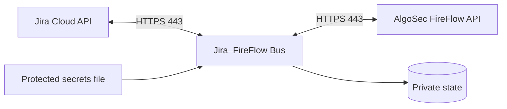

# Jira–FireFlow Bus

Self-contained, outbound-only integration that reads approved network-access requests from
Jira Cloud through its REST API, creates change requests through the AlgoSec FireFlow API,
and mirrors FireFlow progress back to Jira. The bus exposes no inbound HTTP service.



## Install with Docker

The GitHub Release contains one ready `linux/amd64` installer. It embeds the image and all
runtime dependencies; the server does not clone the repository, build an image, or download
Python packages.

```sh
# 1. Download these two assets from release v0.2.1, then verify and run:
sha256sum -c algosec-jira-bus-0.2.1-docker-amd64.run.sha256
sudo sh algosec-jira-bus-0.2.1-docker-amd64.run

# 2. Re-run the configuration wizard after deployment if needed:
sudo bus_conf

# 3. Inspect the service:
sudo docker ps --filter name=algosec-jira-bus
sudo docker logs --tail 100 algosec-jira-bus
```

On a clean Ubuntu/Debian or RHEL/Rocky/AlmaLinux host, the verified `.run` installer
installs Python 3 and Docker Engine from the OS and official Docker repositories when they are
missing. Its default wizard asks for the Jira URL, API email/token, FireFlow URL, API account,
template, devices, and TLS mode before it runs the connectivity doctor. The installer also adds
`sudo bus_conf` for post-deployment changes. Every run asks for the Jira and FireFlow URLs and
API credentials again; enter the current values even when changing only one setting.

Download: [GitHub Release v0.2.1](https://github.com/kdimiter/jira-fireflow-bus/releases/tag/v0.2.1).
The wizard validates both API connections and keeps `apply: false` unless the operator enters
`START`.

Leave **Trust server certificate** disabled, as it is by default, to require full TLS validation
of the CA chain and the hostname or IP address. Enable it only for a private/self-signed
FireFlow certificate or an IP-based connection that cannot pass normal validation. In this
exception mode, CA and hostname checks are replaced by pin-only verification of the exact server
certificate SHA-256 fingerprint. A different certificate is rejected; after certificate renewal
or replacement, run `sudo bus_conf` and approve the new fingerprint.

For an unattended production install, prepare owner-only files on the Linux server and pass
them to the same installer. No ChatGPT, agent, MCP service, repository checkout, compiler, or
package download is used:

```sh
sudo install -d -m 0700 /root/jira-fireflow-deploy
sudo install -o root -g root -m 0600 bus.json secrets.json /root/jira-fireflow-deploy/
sudo sh algosec-jira-bus-0.2.1-docker-amd64.run \
  --config-file /root/jira-fireflow-deploy/bus.json \
  --secrets-file /root/jira-fireflow-deploy/secrets.json
```

`secrets.json` contains exactly `JIRA_API_TOKEN` and `ASMS_API_PASSWORD`. If FireFlow uses a
private CA, stage its PEM file with mode `0600` and add
`--ca-file /root/jira-fireflow-deploy/fireflow-ca.pem`. Use a FireFlow FQDN present in the
certificate SAN; this unattended path keeps full CA and hostname verification enabled. It runs
the new configuration doctor before stopping an existing container and restores the prior
deployment if the replacement cannot start.

The adjacent `.sha256` file checks download integrity. Release reviewers can additionally use
`SHA256SUMS`, `RELEASE-MANIFEST.json`, and the SPDX SBOM published with the release. The manifest
binds the assets and Docker image ID to the exact source revision; it is a traceability record,
not a detached digital signature.

Secrets stay on the Linux host in
`/opt/algosec-jira-docker/config/secrets.json` (`0600`, UID/GID `10001`). State is stored in
`/opt/algosec-jira-docker/state`. The container runs as UID `10001`, with a read-only root
filesystem, all Linux capabilities dropped, and `no-new-privileges`.

For native systemd installation and complete Jira/FireFlow preparation, see the
[step-by-step deployment guide](docs/DEPLOYMENT-GUIDE-uk.md).

## Security model

- Jira and FireFlow origins must be HTTPS.
- Full CA-chain and hostname/IP validation is the default. The optional **Trust server
  certificate** mode replaces those checks for FireFlow with an exact SHA-256 certificate pin.
- Runtime secrets, configuration, state, receipts, and logs are excluded from releases.
- Templates, devices, and writable FireFlow fields are allowlisted.
- Durable operation identifiers, pre-submit receipts, and reconciliation limit duplicate
  changes after uncertain API outcomes.
- One poll scans at most `jira.scan_limit` issues and creates at most `max_per_pass` requests.
- Write mode requires a successful connectivity doctor and explicit operator activation.

## Development and release builds

Python 3.11+ and Node.js 22 are supported. The Python runtime has no third-party dependency.

```sh
python3 -m venv .venv
.venv/bin/python -m pip install -e .
.venv/bin/python -m unittest discover -s tests

cd forge
npm ci --ignore-scripts
npm test
npm run check
npm audit --audit-level=high
```

Maintainers build release artifacts from a verified checkout:

```sh
python3 scripts/build-installer.py \
  --output dist/algosec-jira-bus-0.2.1-linux.run
sh packaging/docker/build-image.sh \
  dist/algosec-jira-bus-0.2.1-linux.run \
  dist/algosec-jira-bus-docker-amd64.tar.gz
python3 scripts/build-docker-installer.py \
  --image dist/algosec-jira-bus-docker-amd64.tar.gz \
  --output dist/algosec-jira-bus-0.2.1-docker-amd64.run
python3 scripts/build-release-metadata.py \
  --directory dist --version 0.2.1 --image algosec-jira-bus:0.2.1
```

The bus submits and tracks a change request. Approval, planning, implementation, and policy
decisions remain in FireFlow. Restrict Jira project permissions and JQL because eligible Jira
issues can initiate FireFlow requests after the configured approval gate.

Licensed under Apache-2.0. Report vulnerabilities as described in [SECURITY.md](SECURITY.md).
