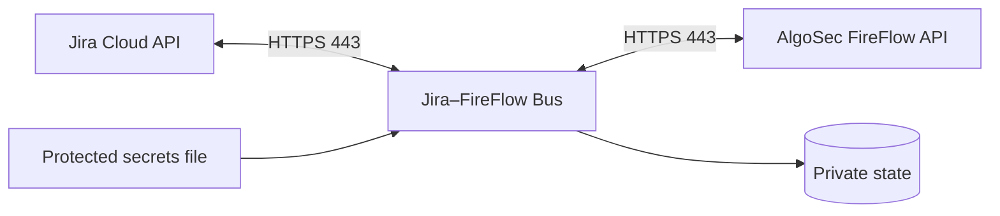
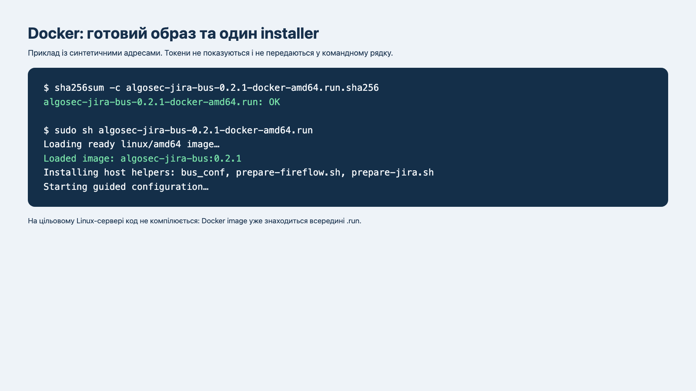
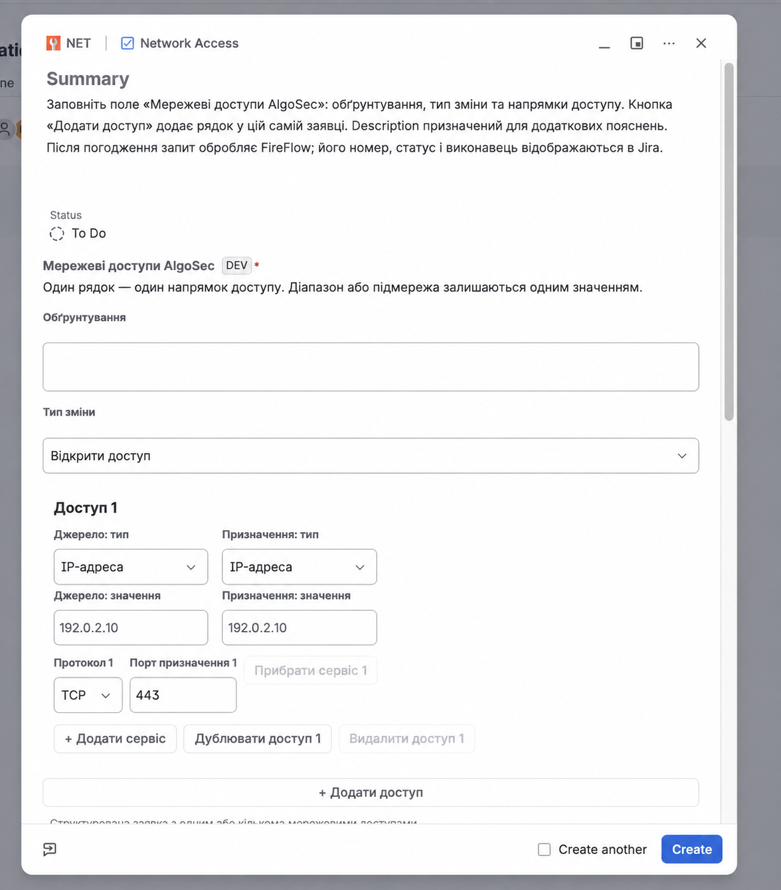
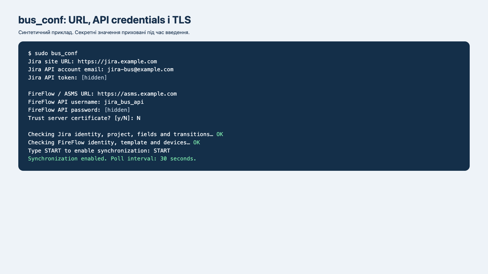
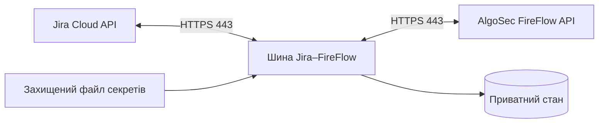

[English](#english) | [Українська](#ukrainian)

<a id="english"></a>

# Jira–FireFlow Bus

Self-contained, outbound-only integration that reads approved network-access requests from
Jira Cloud through its REST API, creates change requests through the AlgoSec FireFlow API,
and mirrors FireFlow progress back to Jira. The bus exposes no inbound HTTP service.



## Install with Docker

The GitHub Release contains one ready `linux/amd64` installer. It embeds the image and all
runtime dependencies; the server does not clone the repository, build an image, or download
Python packages.

```sh
# Use a dedicated download directory on a clean host:
sudo install -d -o "$USER" -g "$(id -gn)" /opt/algosec-install
cd /opt/algosec-install

# Download the ready installer and checksum from the latest release:
curl -fLO https://github.com/kdimiter/jira-fireflow-bus/releases/latest/download/algosec-jira-bus-latest-docker-amd64.run
curl -fLO https://github.com/kdimiter/jira-fireflow-bus/releases/latest/download/algosec-jira-bus-latest-docker-amd64.run.sha256

# Verify the download, then open the complete dialog wizard:
sha256sum -c algosec-jira-bus-latest-docker-amd64.run.sha256
sudo sh algosec-jira-bus-latest-docker-amd64.run --guided

# Re-run only the bus configuration after deployment if needed:
sudo bus_conf

# Refresh only a renewed/replaced FireFlow certificate pin:
sudo bus_conf --refresh-certificate

# Enable or change Jira -> FireFlow comments and status synchronization:
sudo bus_conf --jira-sync

# 3. Inspect the service:
sudo docker ps --filter name=algosec-jira-bus
sudo docker logs --tail 100 algosec-jira-bus
```



`--guided` is the simplest installation path for a new Linux server. It installs missing
Docker and terminal-dialog prerequisites, then reads the compatible Forge apps already installed
in the selected Jira site. The menu identifies each candidate by environment, Jira field ID and
Forge App UUID, and also offers **Register and install a new Forge app**. Selecting an existing
production app skips Node.js, Forge CLI, Forge credentials, deployment and installation. The
wizard pins Jira preparation to that exact App ID. The create-new path installs Node.js 22 and
Forge CLI under the selected non-root operator, registers and installs the app, and then prepares
a company-managed Jira Space with the chosen standard work type. That work type receives the Forge Basic network
request field, the optional FireFlow Request ID, FireFlow Status and FireFlow Owner result
fields, and dedicated work type, screen, field-configuration and workflow schemes. The dedicated
work type scheme contains only the selected integration type. The workflow follows
the Basic FireFlow lifecycle:

```text
To Do -> Plan -> Approve -> Implement -> Validate -> Match -> Done
```

`Rejected` and `Cancelled` are terminal alternatives. `Review` is deliberately absent because
it belongs to the Multi-Approval and Parallel-Approval FireFlow workflows, not Basic. The
wizard then validates and starts the Docker bus. Jira administrator credentials are entered once,
kept only in owner-only temporary files for discovery and preparation, and deleted afterward.
Forge credentials are requested only when deployment is needed. Runtime Jira and FireFlow secrets
remain in the private container configuration.



Upgrade an existing installer-managed container without entering or rewriting its secrets:

```sh
# Download the new installer and checksum before every upgrade:
cd /opt/algosec-install
curl -fLO https://github.com/kdimiter/jira-fireflow-bus/releases/latest/download/algosec-jira-bus-latest-docker-amd64.run
curl -fLO https://github.com/kdimiter/jira-fireflow-bus/releases/latest/download/algosec-jira-bus-latest-docker-amd64.run.sha256

sha256sum -c algosec-jira-bus-latest-docker-amd64.run.sha256
sudo sh algosec-jira-bus-latest-docker-amd64.run --upgrade

# For every later release:
sudo bus_update ./algosec-jira-bus-latest-docker-amd64.run \
  ./algosec-jira-bus-latest-docker-amd64.run.sha256
```

Upgrade mode reads the existing `secrets.json` only for the new-image doctor. It does not
rewrite that file or the persistent state. The old container remains available until the new
container reports `READY`; failure restores the prior `bus.json` and restarts the old container.

For a new environment, install the ready image and the host preparation scripts first:

```sh
sudo sh algosec-jira-bus-latest-docker-amd64.run --prepare-only
sudo prepare-fireflow.sh --base-url https://ASMS-HOST --apply
# Create a company-managed Jira Space, then install the repository Forge app once:
sudo create-jira-space.sh --base-url https://TENANT.atlassian.net \
  --space-key ALGO --space-name "AlgoSec" --apply
# Prepare its work type, fields and screens:
sudo prepare-jira.sh --base-url https://TENANT.atlassian.net \
  --space-key ALGO --space-name "AlgoSec" \
  --work-type-name "AlgoSec Network Access" --apply
sudo sh algosec-jira-bus-latest-docker-amd64.run
```

The `.sh` helpers run through the bundled Docker image and do not use host Python.
`prepare-fireflow.sh` uses ASMS HTTPS APIs, so no SSH access to the AlgoSec host is required.
It creates `jira_bus_api` with ASMS Admin, FireFlow Admin and `ALL_FIREWALLS:Standard`, then
asks for a password without echoing or logging it. AlgoSec creates this as a temporary password:
sign in once through the FireFlow web interface and replace it before running `bus_conf`.
Use a unique password generated by your password manager. `prepare-jira.sh` creates or discovers
the company-managed Space, the selected standard work type, the three result fields, and
dedicated screen, field-configuration and workflow schemes. It assigns the Basic workflow shown
above only to that work type. The dedicated work type scheme contains only this integration type.
Automatic scheme assignment is limited to an empty Space; the helper refuses a required migration
after issues exist. The Forge field is required; FireFlow Request ID, status and owner
are visible but optional. Install the repository Forge app first because Jira REST cannot create
its Forge-owned object field.
`create-jira-space.sh` is the standalone first step: it validates the key and name, creates a
company-managed Space with the authenticated administrator as lead, and safely reuses the same
Space on later runs. Omit `--apply` for a read-only validation. Both Jira helpers accept
`--space-key`/`--space-name` and the older `--project-key`/`--project-name` spellings.
When these options are omitted, the helpers prompt for their values. `prepare-jira.sh` also
prompts for a work type name; `--work-type-name` selects it non-interactively. Use a unique
name when the tenant already contains duplicate `Network Access` work types.

On a clean Ubuntu/Debian or RHEL/Rocky/AlmaLinux host, the verified `.run` installer
installs Python 3 and Docker Engine from the OS and official Docker repositories when they are
missing. Its default wizard asks for the Jira URL, API email/token, FireFlow URL, API account,
and TLS mode before it runs the connectivity doctor. The release uses the configured Basic Change
Traffic Request template and discovers the permitted device tree names through the ASMS API.
The installer adds `sudo bus_conf` for post-deployment changes and `sudo bus_update` for
subsequent release upgrades. Every configuration run asks for the Jira and FireFlow URLs and
API credentials again; enter the current values even when changing only one setting. After
FireFlow authentication, the wizard automatically loads all permitted FireFlow-supported
device tree names from ASMS; they are not typed manually.



`sudo bus_conf --jira-sync` is a separate menu that preserves both API credentials. It can copy
new Jira comments into FireFlow as internal History comments and apply an editable, explicit
`Jira status=FireFlow status` map. Existing comments and transitions are recorded as the initial
baseline and are not replayed. Existing deployments remain disabled after upgrade until this
menu is enabled deliberately. This direction permits only reopen/close outcomes: `open`,
`resolved`, `cancelled`, and `rejected`; approval and implementation stages remain FireFlow-owned.
Role/group-restricted and Jira Service Management internal comments are not copied.
If a FireFlow POST outcome is ambiguous, `queue` exposes only event metadata and
`ack-jira-update KEY comments|statuses EVENT_ID` consumes it only after an operator verifies
FireFlow History. If History proves the POST absent, `retry-jira-update` creates one explicit
superseding operation without deleting the old receipt. The deployment guide gives the exact
container commands.

Download: [latest GitHub Release](https://github.com/kdimiter/jira-fireflow-bus/releases/latest).
The wizard validates both API connections and keeps `apply: false` unless the operator enters
`START`.

Leave **Trust server certificate** disabled, as it is by default, to require full TLS validation
of the CA chain and the hostname or IP address. Enable it only for a private/self-signed
FireFlow certificate or an IP-based connection that cannot pass normal validation. In this
exception mode, CA and hostname checks are replaced by pin-only verification of the exact server
certificate SHA-256 fingerprint. A different certificate is rejected; after certificate renewal
or replacement, run `sudo bus_conf --refresh-certificate` and approve the new fingerprint.

For an unattended production install, prepare owner-only files on the Linux server and pass
them to the same installer. No ChatGPT, agent, MCP service, repository checkout, compiler, or
package download is used:

```sh
sudo install -d -m 0700 /root/jira-fireflow-deploy
sudo install -o root -g root -m 0600 bus.json secrets.json /root/jira-fireflow-deploy/
sudo sh algosec-jira-bus-latest-docker-amd64.run \
  --config-file /root/jira-fireflow-deploy/bus.json \
  --secrets-file /root/jira-fireflow-deploy/secrets.json
```

`secrets.json` contains exactly `JIRA_API_TOKEN` and `ASMS_API_PASSWORD`. If FireFlow uses a
private CA, stage its PEM file with mode `0600` and add
`--ca-file /root/jira-fireflow-deploy/fireflow-ca.pem`. Use a FireFlow FQDN present in the
certificate SAN; this unattended path keeps full CA and hostname verification enabled. It runs
the new configuration doctor before stopping an existing container and restores the prior
deployment if the replacement cannot start.

The adjacent `.sha256` file checks download integrity. Release reviewers can additionally use
`SHA256SUMS`, `RELEASE-MANIFEST.json`, and the SPDX SBOM published with the release. The manifest
binds the assets and Docker image ID to the exact source revision; it is a traceability record,
not a detached digital signature.

Secrets stay on the Linux host in
`/opt/algosec-jira-docker/config/secrets.json` (`0600`, UID/GID `10001`). State is stored in
`/opt/algosec-jira-docker/state`. The container runs as UID `10001`, with a read-only root
filesystem, all Linux capabilities dropped, and `no-new-privileges`.

For native systemd installation and complete Jira/FireFlow preparation, see the
[step-by-step deployment guide](docs/DEPLOYMENT-GUIDE-uk.md).

## Security model

- Jira and FireFlow origins must be HTTPS.
- Full CA-chain and hostname/IP validation is the default. The optional **Trust server
  certificate** mode replaces those checks for FireFlow with an exact SHA-256 certificate pin.
- Runtime secrets, configuration, state, receipts, and logs are excluded from releases.
- Templates, devices, and writable FireFlow fields are allowlisted.
- Durable operation identifiers, pre-submit receipts, and reconciliation limit duplicate
  changes after uncertain API outcomes.
- Jira-to-FireFlow writes are opt-in and use an explicit status allowlist. FireFlow-originated
  Jira events carry an origin marker to prevent feedback loops.
- One poll scans at most `jira.scan_limit` issues and creates at most `max_per_pass` requests.
- Write mode requires a successful connectivity doctor and explicit operator activation.

## Development and release builds

Python 3.11+ and Node.js 22 are supported. The Python runtime has no third-party dependency.

```sh
python3 -m venv .venv
.venv/bin/python -m pip install -e .
.venv/bin/python -m unittest discover -s tests

cd forge
npm ci --ignore-scripts
npm test
npm run check
npm audit --audit-level=high
```

Maintainers build release artifacts from a verified checkout:

```sh
python3 scripts/build-installer.py \
  --output dist/algosec-jira-bus-0.3.10-linux.run
sh packaging/docker/build-image.sh \
  dist/algosec-jira-bus-0.3.10-linux.run \
  dist/algosec-jira-bus-0.3.10-docker-amd64.tar.gz
python3 scripts/build-docker-installer.py \
  --image dist/algosec-jira-bus-0.3.10-docker-amd64.tar.gz \
  --output dist/algosec-jira-bus-0.3.10-docker-amd64.run
python3 scripts/build-release-metadata.py \
  --directory dist --version 0.3.10 --image algosec-jira-bus:0.3.10

# Publish these stable aliases in every release so README download URLs never change:
cp dist/algosec-jira-bus-0.3.10-docker-amd64.run \
  dist/algosec-jira-bus-latest-docker-amd64.run
cp dist/algosec-jira-bus-0.3.10-linux.run \
  dist/algosec-jira-bus-latest-linux.run
(cd dist && shasum -a 256 algosec-jira-bus-latest-docker-amd64.run \
  > algosec-jira-bus-latest-docker-amd64.run.sha256)
(cd dist && shasum -a 256 algosec-jira-bus-latest-linux.run \
  > algosec-jira-bus-latest-linux.run.sha256)
```

The bus submits and tracks a change request. Approval, planning, implementation, and policy
decisions remain in FireFlow. Restrict Jira project permissions and JQL because eligible Jira
issues can initiate FireFlow requests after the configured approval gate.
When Jira exposes a valid issue creator email, it is sent as the FireFlow `Requestor`.
If Jira hides or omits the email, the request is still created without `Requestor`; FireFlow
assigns `Owner` according to its workflow.

Reverse synchronization uses the FireFlow RT REST compatibility endpoint because the public
FireFlow API exposes request creation and reads but no internal-comment or status-transition
operation. Test the configured mappings against the customer's FireFlow version before enabling
them. Jira authors are preserved in comment text; FireFlow records the integration API account as
the technical actor.

Licensed under Apache-2.0. Report vulnerabilities as described in [SECURITY.md](SECURITY.md).

---

<a id="ukrainian"></a>

# Шина Jira–FireFlow

Самодостатня outbound-only інтеграція читає погоджені заявки на мережевий доступ із Jira
Cloud через REST API, створює change request через API AlgoSec FireFlow і повертає перебіг
обробки до Jira. Шина не відкриває вхідний HTTP-сервіс.



## Рекомендоване встановлення Docker

[Останній реліз](https://github.com/kdimiter/jira-fireflow-bus/releases/latest)
містить готовий installer для `linux/amd64` із Docker-образом і всіма runtime-залежностями.
На сервері не потрібно клонувати Git-репозиторій, збирати образ або встановлювати Python-пакети.

```sh
sudo install -d -o "$USER" -g "$(id -gn)" /opt/algosec-install
cd /opt/algosec-install

curl -fLO https://github.com/kdimiter/jira-fireflow-bus/releases/latest/download/algosec-jira-bus-latest-docker-amd64.run
curl -fLO https://github.com/kdimiter/jira-fireflow-bus/releases/latest/download/algosec-jira-bus-latest-docker-amd64.run.sha256

sha256sum -c algosec-jira-bus-latest-docker-amd64.run.sha256
sudo sh algosec-jira-bus-latest-docker-amd64.run --guided
```


Режим `--guided` відкриває єдиний діалоговий майстер, який:

- встановлює відсутні системні залежності й Docker;
- читає із Jira перелік сумісних Forge-застосунків і показує їхнє середовище, field ID та App UUID;
- дає вибрати встановлений production-застосунок або створити новий;
- для встановленого production-застосунку пропускає Node.js, Forge CLI, Forge token, deploy та install;
- лише для нового або ще не production-застосунку встановлює Node.js 22 і Forge CLI під
  вибраним непривілейованим Linux-користувачем та виконує deploy/install;
- створює або повторно використовує company-managed Jira Space;
- створює вибраний standard work type із Forge-формою Basic network request;
- додає необов'язкові поля FireFlow Request ID, FireFlow Status і FireFlow Owner;
- створює окремі work type, screen, field-configuration і workflow schemes;
- запитує Jira URL, email, API token, FireFlow URL, API account і режим TLS;
- запускає connectivity doctor і лише після успішної перевірки активує контейнер.

Jira administrator email і token вводяться один раз. Майстер тримає їх лише у тимчасових
owner-only файлах для пошуку Forge-застосунків і підготовки Jira, після чого видаляє.

Структуроване Forge-поле стає обов'язковим лише для вибраного мережевого work type.
Поля FireFlow Request ID, Status і Owner залишаються видимими та необов'язковими. Окрема work
type scheme містить лише вибраний інтеграційний тип і не змінює схеми інших Space. Автоматичне
призначення схем виконується лише для порожнього Space; якщо в ньому вже є заявки і потрібна
міграція, helper зупиняється. Для вибраного типу майстер створює Basic workflow:

```text
To Do -> Plan -> Approve -> Implement -> Validate -> Match -> Done
```

`Rejected` і `Cancelled` є альтернативними кінцевими статусами. Статусу `Review` тут немає:
він належить до FireFlow Multi-Approval та Parallel-Approval, а не до Basic workflow.


## Керування після встановлення

```sh
# Перевірити контейнер і останні повідомлення:
sudo docker ps --filter name=algosec-jira-bus
sudo docker logs --tail 100 algosec-jira-bus

# Повторно відкрити конфігурацію шини:
sudo bus_conf

# Прийняти новий сертифікат FireFlow після його заміни:
sudo bus_conf --refresh-certificate

# Налаштувати opt-in синхронізацію коментарів і статусів Jira -> FireFlow:
sudo bus_conf --jira-sync
```


Майстер залишає `apply: false`, доки оператор явно не введе `START`. Після успішного запуску
контейнер опитує Jira та FireFlow через HTTPS. Створення, погодження, планування й виконання
змін залишаються під контролем workflow FireFlow.

## Безпечне оновлення

Для переходу на останній реліз без повторного введення або перезапису секретів:

```sh
cd /opt/algosec-install
curl -fLO https://github.com/kdimiter/jira-fireflow-bus/releases/latest/download/algosec-jira-bus-latest-docker-amd64.run
curl -fLO https://github.com/kdimiter/jira-fireflow-bus/releases/latest/download/algosec-jira-bus-latest-docker-amd64.run.sha256

sha256sum -c algosec-jira-bus-latest-docker-amd64.run.sha256
sudo sh algosec-jira-bus-latest-docker-amd64.run --upgrade
```

Для наступних версій використовуйте встановлену команду:

```sh
sudo bus_update ./algosec-jira-bus-latest-docker-amd64.run \
  ./algosec-jira-bus-latest-docker-amd64.run.sha256
```

Режим upgrade перевіряє новий image з чинними read-only secrets і не змінює `secrets.json`
або state. Старий контейнер зупиняється лише після успішного doctor; якщо новий контейнер не
стає `READY`, попередня конфігурація й контейнер відновлюються.

## Окрема підготовка систем

Якщо Jira та FireFlow потрібно підготувати окремими кроками:

```sh
sudo sh algosec-jira-bus-latest-docker-amd64.run --prepare-only

sudo prepare-fireflow.sh --base-url https://ASMS-HOST --apply

sudo create-jira-space.sh --base-url https://TENANT.atlassian.net \
  --space-key ALGO --space-name "AlgoSec" --apply

sudo prepare-jira.sh --base-url https://TENANT.atlassian.net \
  --space-key ALGO --space-name "AlgoSec" \
  --work-type-name "AlgoSec Network Access" --apply

sudo sh algosec-jira-bus-latest-docker-amd64.run
```

Ці `.sh`-команди використовують вбудований Docker-образ і не залежать від Python на host.
`prepare-fireflow.sh` працює через HTTPS API, тому SSH-доступ до AlgoSec appliance не потрібний.
`prepare-jira.sh` приймає власні назви Space і work type та безпечно повторно використовує
керовані ним об'єкти. Він також створює та призначає окремі work type і workflow schemes для
цього інтеграційного типу та не змінює схеми інших Space. Якщо Space уже містить заявки,
helper відмовляється виконувати потрібну автоматичну міграцію схем.

## TLS і зберігання секретів

За замовчуванням шина перевіряє CA chain та hostname/IP сертифіката. **Trust server
certificate** слід увімкати лише для приватного/self-signed сертифіката або підключення за IP,
яке не проходить звичайну перевірку. У цьому режимі шина закріплює точний SHA-256 fingerprint;
інший сертифікат буде відхилено. Після планової заміни сертифіката виконайте
`sudo bus_conf --refresh-certificate`.

Секрети зберігаються лише на Linux host у
`/opt/algosec-jira-docker/config/secrets.json` з правами `0600` і UID/GID `10001`. Стан
зберігається в `/opt/algosec-jira-docker/state`. Контейнер працює як UID `10001`, має read-only
root filesystem, скинуті Linux capabilities та `no-new-privileges`.

Повна покрокова підготовка Jira, Forge, FireFlow та Linux наведена в
[українській інструкції](docs/DEPLOYMENT-GUIDE-uk.md). Native systemd installer
`algosec-jira-bus-latest-linux.run` також доступний у релізі, але Docker installer є основним
варіантом для нового розгортання.

Ліцензія Apache-2.0. Інструкції для приватного повідомлення про вразливості наведені в
[SECURITY.md](SECURITY.md).
