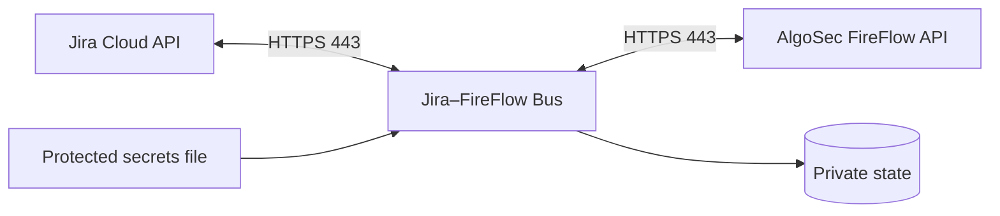

# Jira–FireFlow Bus

Self-contained, outbound-only integration that reads approved network-access requests from
Jira Cloud through its REST API, creates change requests through the AlgoSec FireFlow API,
and mirrors FireFlow progress back to Jira. The bus exposes no inbound HTTP service.



## Install with Docker

The GitHub Release contains one ready `linux/amd64` installer. It embeds the image and all
runtime dependencies; the server does not clone the repository, build an image, or download
Python packages.

```sh
# 1. Install Docker Engine and Python 3 first: https://docs.docker.com/engine/install/
# 2. Download these two assets from release v0.2.0, then verify and run:
sha256sum -c algosec-jira-bus-0.2.0-docker-amd64.run.sha256
sudo sh algosec-jira-bus-0.2.0-docker-amd64.run

# 3. After the wizard, inspect the service:
sudo docker ps --filter name=algosec-jira-bus
sudo docker logs --tail 100 algosec-jira-bus
```

Download: [GitHub Release v0.2.0](https://github.com/kdimiter/jira-fireflow-bus/releases/tag/v0.2.0).
The wizard validates both API connections and keeps `apply: false` unless the operator enters
`START`.

The adjacent `.sha256` file checks download integrity. Release reviewers can additionally use
`SHA256SUMS`, `RELEASE-MANIFEST.json`, and the SPDX SBOM published with the release. The manifest
binds the assets and Docker image ID to the exact source revision; it is a traceability record,
not a detached digital signature.

Secrets stay on the Linux host in
`/opt/algosec-jira-docker/config/secrets.json` (`0600`, UID/GID `10001`). State is stored in
`/opt/algosec-jira-docker/state`. The container runs as UID `10001`, with a read-only root
filesystem, all Linux capabilities dropped, and `no-new-privileges`.

For native systemd installation and complete Jira/FireFlow preparation, see the
[step-by-step deployment guide](docs/DEPLOYMENT-GUIDE-uk.md).

## Security model

- Jira and FireFlow origins must be HTTPS.
- Normal CA and hostname validation always remains enabled; an exact certificate SHA-256 pin
  can add another check.
- Runtime secrets, configuration, state, receipts, and logs are excluded from releases.
- Templates, devices, and writable FireFlow fields are allowlisted.
- Durable operation identifiers, pre-submit receipts, and reconciliation limit duplicate
  changes after uncertain API outcomes.
- One poll scans at most `jira.scan_limit` issues and creates at most `max_per_pass` requests.
- Write mode requires a successful connectivity doctor and explicit operator activation.

## Development and release builds

Python 3.11+ and Node.js 22 are supported. The Python runtime has no third-party dependency.

```sh
python3 -m venv .venv
.venv/bin/python -m pip install -e .
.venv/bin/python -m unittest discover -s tests

cd forge
npm ci --ignore-scripts
npm test
npm run check
npm audit --audit-level=high
```

Maintainers build release artifacts from a verified checkout:

```sh
python3 scripts/build-installer.py \
  --output dist/algosec-jira-bus-0.2.0-linux.run
sh packaging/docker/build-image.sh \
  dist/algosec-jira-bus-0.2.0-linux.run \
  dist/algosec-jira-bus-docker-amd64.tar.gz
python3 scripts/build-docker-installer.py \
  --image dist/algosec-jira-bus-docker-amd64.tar.gz \
  --output dist/algosec-jira-bus-0.2.0-docker-amd64.run
python3 scripts/build-release-metadata.py \
  --directory dist --version 0.2.0 --image algosec-jira-bus:0.2.0
```

The bus submits and tracks a change request. Approval, planning, implementation, and policy
decisions remain in FireFlow. Restrict Jira project permissions and JQL because eligible Jira
issues can initiate FireFlow requests after the configured approval gate.

Licensed under Apache-2.0. Report vulnerabilities as described in [SECURITY.md](SECURITY.md).
