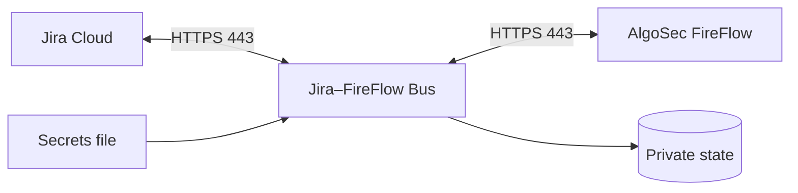

# Jira–FireFlow Bus

Outbound-only integration that reads approved network-access requests from Jira Cloud,
creates change requests in AlgoSec FireFlow, and mirrors FireFlow progress back to Jira.
The bus does not expose an inbound HTTP service.

```text
Jira Cloud  <--- outbound HTTPS --->  bus  <--- outbound HTTPS --->  FireFlow
```



## Security model

- HTTPS is required for both Jira and ASMS origins.
- Standard CA and hostname validation is used; an exact SHA-256 certificate pin is optional.
- Runtime secrets stay outside the repository and container image.
- Write mode is disabled until an operator runs the connectivity doctor and explicitly enables it.
- Templates, devices, and writable FireFlow fields are allowlisted.
- Durable operation identifiers, receipts, and reconciliation guard against duplicate changes.
- One poll scans at most `jira.scan_limit` issues and creates at most `max_per_pass` requests.

The FireFlow transport adapter is distributed separately through an authorized channel and
is not included in this public repository or its releases. Obtain its universal wheel and
SHA-256 digest from your administrator.

## Development

Python 3.11 or newer and Node.js 22 are supported.

```sh
python3 -m venv .venv
.venv/bin/python -m pip install /authorized/algosec_host_mcp-VERSION-py3-none-any.whl
.venv/bin/python -m pip install -e .
.venv/bin/python -m unittest discover -s tests

cd forge
npm ci
npm test
npm run check
npm audit --audit-level=high
```

## Quick installation

Prepare Jira fields and dedicated Jira and ASMS accounts first. Obtain the private
connector wheel and its expected SHA-256 digest through an authorized channel. Never
commit the wheel or credentials.

Build the source-only installer:

```sh
python3 scripts/build-installer.py --output dist/algosec-jira-bus-linux.run
```

Install it on Linux with the connector supplied separately:

```sh
sudo sh install.sh --mode native \
  --bundle "$(pwd)/dist/algosec-jira-bus-linux.run" -- \
  --connector-wheel /secure/algosec_host_mcp-VERSION-py3-none-any.whl \
  --connector-sha256 EXPECTED_64_HEX_DIGEST
```

For Docker, build a private image archive on a trusted Linux amd64 host, then run its
installer:

```sh
sh packaging/docker/build-image.sh \
  dist/algosec-jira-bus-linux.run \
  /secure/algosec_host_mcp-VERSION-py3-none-any.whl \
  EXPECTED_64_HEX_DIGEST \
  dist/algosec-jira-bus-docker-amd64.tar.gz

sudo sh install.sh --mode docker -- \
  --image-archive "$(pwd)/dist/algosec-jira-bus-docker-amd64.tar.gz" \
  --image-sha256 EXPECTED_IMAGE_64_HEX_DIGEST
```

The interactive wizard keeps synchronization in dry-run unless an operator explicitly
enters `START`. See the [step-by-step Linux and Docker deployment
guide](docs/DEPLOYMENT-GUIDE-uk.md) and the [sanitized configuration
example](examples/jira-sync-basic-structured.json).

## Scope

The bus submits and tracks a change request. Approval, planning, implementation, and policy
decisions remain in FireFlow. Restrict Jira project permissions and JQL because eligible
Jira issues can initiate FireFlow requests after the configured approval gate.

Licensed under Apache-2.0. Security reports must follow [SECURITY.md](SECURITY.md).
