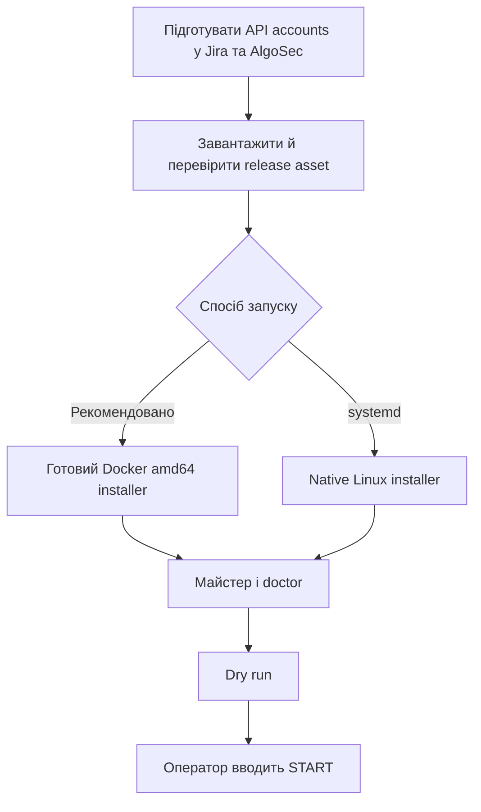

# Встановлення Jira–FireFlow Bus на Linux

Шина є самодостатньою: вона напряму працює з Jira Cloud REST API та AlgoSec FireFlow API.
Вхідних портів немає. Потрібні лише DNS і вихідний HTTPS/443 до двох дозволених адрес.



## 1. Підготуйте доступи

Створіть окремі технічні accounts для інтеграції. Не використовуйте особистий account або
повні Jira/ASMS administrator roles. Обмежте Jira account одним інтеграційним project і
потрібними workflow transitions, а FireFlow account — конкретними template та devices.

### Jira Cloud API token

1. Увійдіть під технічним Atlassian account.
2. Відкрийте [Atlassian Account → Security → API tokens](https://id.atlassian.com/manage-profile/security/api-tokens).
3. Натисніть **Create API token**, задайте зрозумілу назву та строк дії.
4. Скопіюйте token у password manager. Після закриття сторінки його повторно не покажуть.
5. У майстрі вкажіть tenant як `https://your-tenant.atlassian.net`, email технічного
   account і створений token.

Ця версія використовує tenant URL та Basic auth з API token. Scoped token через
`api.atlassian.com/ex/jira/{cloudId}` у майстрі не підтримується.

До запуску майстра зареєструйте власний Forge app і додайте structured field до потрібного
Jira work type. Також створіть text fields для FireFlow Request ID, Status і Owner. Цей крок
виконується один раз на адміністративній workstation, а не всередині runtime container:

```sh
git clone --branch v0.2.0 --depth 1 https://github.com/kdimiter/jira-fireflow-bus.git
cd jira-fireflow-bus
cd forge
npm ci --ignore-scripts
cd ..
sh scripts/setup-forge.sh
```

### AlgoSec FireFlow API account

Підготуйте існуючий окремий FireFlow API account. Майстер не створює account і не призначає
ролі. Адміністратор має надати лише права, перевірені для обраного traffic-request template
і точного переліку devices. Повні ASMS Admin, FireFlow Admin і `ALL_FIREWALLS` не потрібні.

## 2. Docker: найпростіше встановлення

Підтримується Linux `amd64`/`x86_64`. Release asset уже містить готовий image і всі runtime
dependencies; на server нічого не компілюється і не збирається.

### 2.1. Встановіть Docker Engine

Встановіть Python 3 для локальної перевірки та розпакування installer. На
Ubuntu/Debian це `sudo apt-get install -y ca-certificates python3`, на RHEL/CentOS —
`sudo dnf install -y ca-certificates python3`. Потім встановіть Docker за офіційною
інструкцією для вашої ОС:
[Ubuntu](https://docs.docker.com/engine/install/ubuntu/),
[RHEL](https://docs.docker.com/engine/install/rhel/) або
[CentOS](https://docs.docker.com/engine/install/centos/). Після інсталяції:

```sh
sudo systemctl enable --now docker
sudo docker version
test "$(uname -m)" = x86_64
```

### 2.2. Завантажте й запустіть один installer

Відкрийте [GitHub Release v0.2.0](https://github.com/kdimiter/jira-fireflow-bus/releases/tag/v0.2.0)
і завантажте два assets:

- `algosec-jira-bus-0.2.0-docker-amd64.run`
- `algosec-jira-bus-0.2.0-docker-amd64.run.sha256`

У каталозі із завантаженими файлами:

```sh
sha256sum -c algosec-jira-bus-0.2.0-docker-amd64.run.sha256
sudo sh algosec-jira-bus-0.2.0-docker-amd64.run
```

Файл `.sha256` перевіряє цілісність завантаження. Для повної перевірки release також
публікуються `SHA256SUMS`, `RELEASE-MANIFEST.json` і SPDX SBOM. Manifest зв'язує assets та
Docker image ID з точним Git revision; це запис для відстеження походження, а не окремий
цифровий підпис.

Installer повторно перевіряє власний payload та вбудований image перед `docker load`, запускає
майстер і створює container лише після успішного `doctor`. У майстрі введіть Jira tenant,
API email/token, ASMS URL, FireFlow API user/password, template та дозволені devices.

Введення `START` вмикає синхронізацію. Порожня відповідь зберігає `apply: false`.

Перевірка:

```sh
sudo docker ps --filter name=algosec-jira-bus
sudo docker logs --tail 100 algosec-jira-bus
```

Секрети зберігаються на host у
`/opt/algosec-jira-docker/config/secrets.json` (`0600`, UID/GID `10001`). Config монтується
read-only, а state окремо з write access у `/opt/algosec-jira-docker/state`. Container
працює як UID `10001` з read-only root filesystem, `cap-drop ALL` і
`no-new-privileges`.

## 3. Native Linux із systemd

Native installer також самодостатній і не звертається до Python package index. Він потребує
запущений systemd та Python 3.11+.

Ubuntu 24.04+/Debian 12+:

```sh
sudo apt-get update
sudo apt-get install -y ca-certificates python3 python3-venv
python3 -c 'import sys; assert sys.version_info >= (3, 11), sys.version'
```

Rocky Linux 8/9:

```sh
sudo dnf install -y ca-certificates python3.11
python3.11 -c 'import sys, venv; assert sys.version_info >= (3, 11)'
```

З [GitHub Release v0.2.0](https://github.com/kdimiter/jira-fireflow-bus/releases/tag/v0.2.0)
завантажте `algosec-jira-bus-0.2.0-linux.run` і сусідній `.sha256`, потім:

```sh
sha256sum -c algosec-jira-bus-0.2.0-linux.run.sha256
sudo sh algosec-jira-bus-0.2.0-linux.run
sudo systemctl status algosec-jira-bus.timer algosec-jira-bus-reconcile.timer
sudo journalctl -u algosec-jira-bus.service -n 100 --no-pager
```

Native secrets: `/etc/algosec-jira-bus/secrets.env`, режим `0600`, власник
`algosec-jira-bus`. Config використовує `env:JIRA_API_TOKEN` і
`env:ASMS_API_PASSWORD`. State, receipts та journal розміщені у
`/var/lib/algosec-jira-bus` (`0700`).

## 4. Перевірка перед увімкненням

1. Перевірте tenant, project, work type, custom fields, template і конкретні devices.
2. Залиште `apply: false` і звузьте JQL до інтеграційного project/work type.
3. Переконайтесь, що `doctor` успішно перевірив TLS, Jira identity, поля, ASMS identity,
   template та devices.
4. Перегляньте один dry-run і journal.
5. Введіть `START` лише після перевірки очікуваної кількості traffic lines та їх digest.

`jira.scan_limit` обмежує кількість issues, прочитаних за poll. `max_per_pass` окремо обмежує
кількість FireFlow requests, які можна створити за один прохід. Оновлення installer не
перезаписує наявні secrets, config або state. Перед оновленням старої інсталяції перенесіть
секрети у відповідний приватний secrets-файл і використовуйте лише посилання
`env:JIRA_API_TOKEN`, `env:ASMS_API_PASSWORD` або інші `env:NAME`: installer відмовиться
зупиняти чинний сервіс, якщо конфігурація містить несумісний спосіб зберігання секретів.
