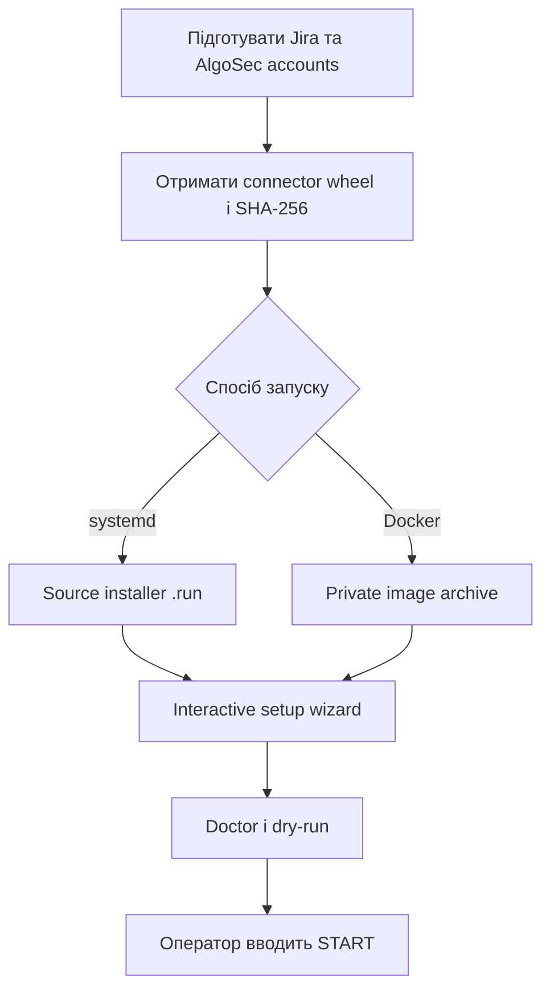

# Встановлення Jira–FireFlow Bus на Linux

Шина не відкриває вхідний HTTP-порт. Їй потрібен лише вихідний HTTPS/443 до Jira Cloud і
AlgoSec ASMS/FireFlow.



## 1. Передумови

- Linux із `sudo`; для native-режиму потрібен запущений systemd і Python 3.11+.
- Для Docker потрібен Linux amd64/x86_64 із Docker Engine.
- DNS і вихідний TCP/443 до вашого Jira tenant та AlgoSec ASMS.
- Окремі Jira та ASMS API accounts з мінімальними правами.
- Власний зареєстрований Forge app та поля Jira.
- `algosec_host_mcp-*-py3-none-any.whl` і очікуваний SHA-256 з авторизованого каналу.

Майстер не створює accounts і не призначає ролі. Адміністратор надає лише права,
перевірені для конкретного FireFlow template і дозволених devices. Повний ASMS Admin,
FireFlow Admin і `ALL_FIREWALLS` не є типовою вимогою.

## 2. Підготовка Jira

1. Створіть окремий Atlassian service account або технічного користувача.
2. Надайте доступ лише до інтеграційного project і потрібних workflow transitions.
3. Відкрийте [Atlassian Account → Security → API tokens](https://id.atlassian.com/manage-profile/security/api-tokens), натисніть **Create API token**, задайте назву та строк дії, скопіюйте token у password manager. Поточний клієнт працює з tenant URL та Basic auth, тому використовуйте token без scopes; scoped token потребує gateway URL `api.atlassian.com/ex/jira/{cloudId}` і цією версією майстра не підтримується.
4. Увійдіть у Forge CLI та зареєструйте app:

   ```sh
   cd forge
   npm ci
   cd ..
   sh scripts/setup-forge.sh
   ```

5. Додайте structured field до потрібного Jira work type. Створіть три text fields для
   FireFlow Request ID, FireFlow Status і FireFlow Owner.

Значення tenant, project key, work type і `customfield_*` у `examples/` є placeholders.

## 3. Native Linux із systemd через `install.sh`

### 3.1. Встановіть системні залежності

Ubuntu 24.04+/Debian 12+:

```sh
sudo apt-get update
sudo apt-get install -y ca-certificates git python3 python3-venv
python3 -c 'import sys; assert sys.version_info >= (3, 11), sys.version'
```

Rocky Linux 8/9:

```sh
sudo dnf install -y ca-certificates git python3.11
python3.11 -c 'import sys, venv, ensurepip; assert sys.version_info >= (3, 11)'
```

CentOS 7 потребує окремого Python 3.11+ у `/opt/algosec-jira-bus/python`; системний
Python 3.7 не підходить. Скрипт не завантажує runtime автоматично.

### 3.2. Перевірте connector і побудуйте installer

```sh
git clone https://github.com/kdimiter/jira-fireflow-bus.git
cd jira-fireflow-bus

CONNECTOR_WHEEL=/secure/algosec_host_mcp-VERSION-py3-none-any.whl
CONNECTOR_SHA256=EXPECTED_64_HEX_DIGEST
test "$(sha256sum "$CONNECTOR_WHEEL" | cut -d ' ' -f1)" = "$CONNECTOR_SHA256"

python3 scripts/build-installer.py --output dist/algosec-jira-bus-linux.run
sha256sum -c dist/algosec-jira-bus-linux.run.sha256
```

Очікуваний digest беріть у адміністратора або з підписаного manifest. Digest,
обчислений із невідомого wheel, не є незалежною перевіркою.

### 3.3. Встановіть і пройдіть майстер

```sh
sudo sh install.sh --mode native \
  --bundle "$(pwd)/dist/algosec-jira-bus-linux.run" -- \
  --connector-wheel "$CONNECTOR_WHEEL" \
  --connector-sha256 "$CONNECTOR_SHA256"
```

Майстер перевірить Jira identity, поля, HTTPS до ASMS, template та devices. Введіть
`START` лише після успішного `doctor`; порожня відповідь залишає `apply: false`.

Перевірка після встановлення:

```sh
sudo systemctl status algosec-jira-bus.timer algosec-jira-bus-reconcile.timer
sudo systemctl start algosec-jira-bus.service
sudo journalctl -u algosec-jira-bus.service -n 100 --no-pager
```

Секрети: `/etc/algosec-jira-bus/secrets.env`, режим `0600`, власник
`algosec-jira-bus`. Конфігурація посилається на `env:JIRA_API_TOKEN` та
`env:ASMS_API_PASSWORD`. State, approval records, receipts і journal розміщені у
`/var/lib/algosec-jira-bus`, каталог `0700`.

## 4. Docker через `install.sh`

### 4.1. Встановіть Docker Engine

Використовуйте офіційний repository Docker для вашого Linux:

- [Ubuntu](https://docs.docker.com/engine/install/ubuntu/)
- [CentOS Stream](https://docs.docker.com/engine/install/centos/)
- [RHEL](https://docs.docker.com/engine/install/rhel/)

Для Ubuntu спочатку додайте офіційний Docker `apt` repository за інструкцією вище,
потім встановіть залежності:

```sh
sudo apt-get update
sudo apt-get install -y ca-certificates curl git python3 \
  docker-ce docker-ce-cli containerd.io docker-buildx-plugin docker-compose-plugin
sudo systemctl enable --now docker
```

Для CentOS Stream 9/10:

```sh
sudo dnf -y install ca-certificates git python3 dnf-plugins-core
sudo dnf config-manager --add-repo https://download.docker.com/linux/centos/docker-ce.repo
sudo dnf install -y docker-ce docker-ce-cli containerd.io docker-buildx-plugin docker-compose-plugin
sudo systemctl enable --now docker
```

Перевірте daemon і архітектуру target host:

```sh
sudo docker version
test "$(uname -m)" = x86_64
sudo docker run --rm hello-world
```

### 4.2. Побудуйте приватний image archive

На довіреному Linux amd64 build host:

```sh
git clone https://github.com/kdimiter/jira-fireflow-bus.git
cd jira-fireflow-bus

CONNECTOR_WHEEL=/secure/algosec_host_mcp-VERSION-py3-none-any.whl
CONNECTOR_SHA256=EXPECTED_64_HEX_DIGEST
test "$(sha256sum "$CONNECTOR_WHEEL" | cut -d ' ' -f1)" = "$CONNECTOR_SHA256"

python3 scripts/build-installer.py --output dist/algosec-jira-bus-linux.run
sh packaging/docker/build-image.sh \
  dist/algosec-jira-bus-linux.run \
  "$CONNECTOR_WHEEL" \
  "$CONNECTOR_SHA256" \
  dist/algosec-jira-bus-docker-amd64.tar.gz
sha256sum -c dist/algosec-jira-bus-docker-amd64.tar.gz.sha256
```

Image містить приватний connector, тому archive і image не можна додавати до GitHub
Release або public registry.

### 4.3. Встановіть archive на Linux server

На Linux server клонуйте цей repository або скопіюйте його source tree разом з image
archive. Отримайте очікуваний SHA-256 через окремий авторизований канал, потім виконайте:

```sh
IMAGE_SHA256=EXPECTED_IMAGE_64_HEX_DIGEST
test "$(sha256sum algosec-jira-bus-docker-amd64.tar.gz | cut -d ' ' -f1)" = "$IMAGE_SHA256"
sudo sh install.sh --mode docker -- \
  --image-archive "$(pwd)/algosec-jira-bus-docker-amd64.tar.gz" \
  --image-sha256 "$IMAGE_SHA256" \
  --data-dir /opt/algosec-jira-docker
```

`install.sh` передає Docker-режим захищеному `install-docker.sh`: той перевіряє digest,
завантажує image, запускає інтерактивний майстер і стартує container
лише після валідної конфігурації. Перевірка:

```sh
sudo docker ps --filter name=algosec-jira-bus
sudo docker logs --tail 100 algosec-jira-bus
```

Секрети на host: `/opt/algosec-jira-docker/config/secrets.json`; directory `0700`, file
`0600`, UID/GID `10001`. Config монтується read-only у container, state окремо з write
access. Container працює без root, із read-only root filesystem, `cap-drop ALL` та
`no-new-privileges`.

## 5. Активація та межі

1. Перевірте tenant, project, work type, custom fields, template і конкретні devices.
2. Залиште `apply: false` та звузьте JQL до інтеграційного project/work type.
3. Виконайте `doctor`: TLS, Jira identity, поля, ASMS identity, template і devices мають
   пройти перевірку.
4. Перевірте один dry-run і журнал.
5. Увімкніть запис тільки явним `START`.

`jira.scan_limit` обмежує кількість прочитаних issues за poll. Перевищення завершує poll
помилкою і вимагає звузити JQL. `max_per_pass` окремо обмежує кількість створених FireFlow
requests.
