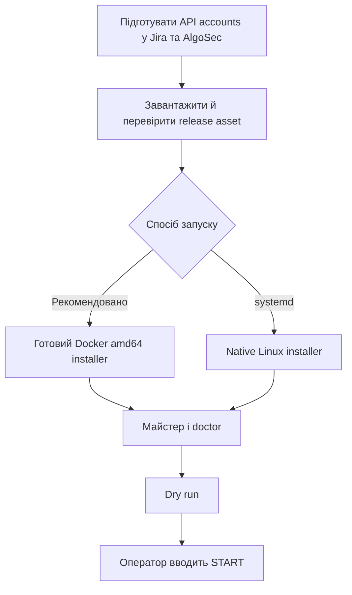
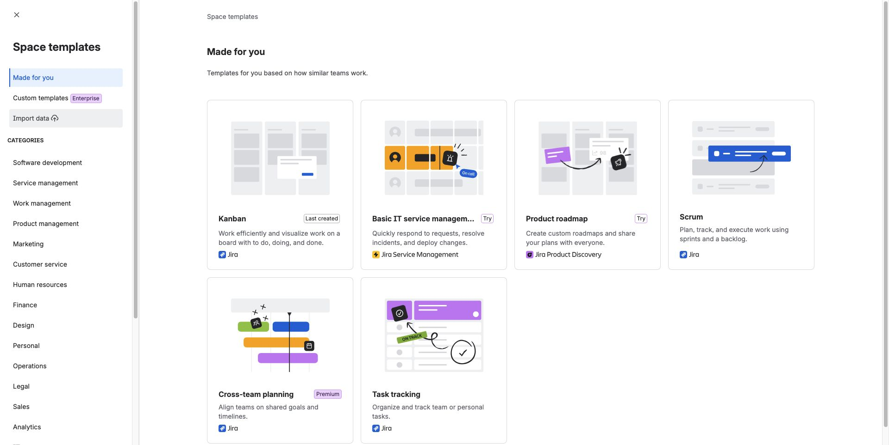
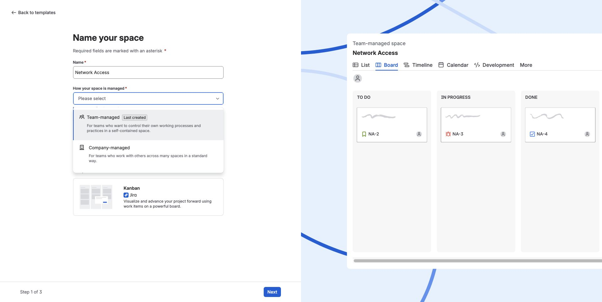
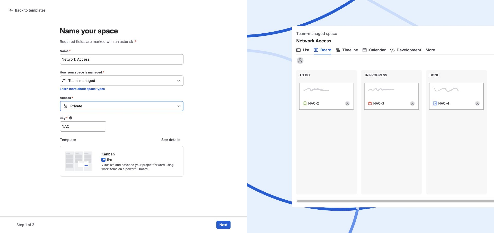
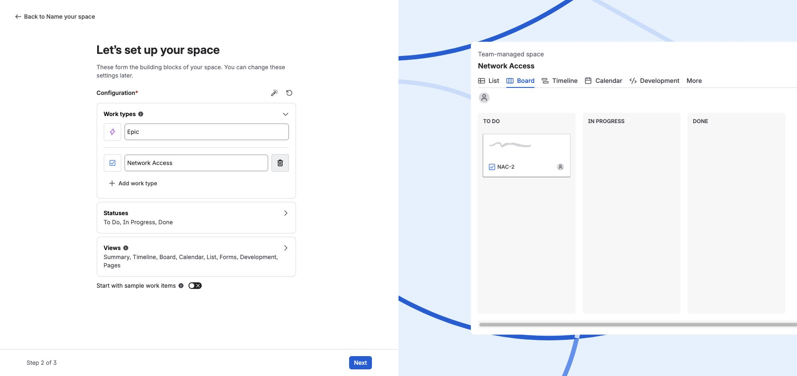
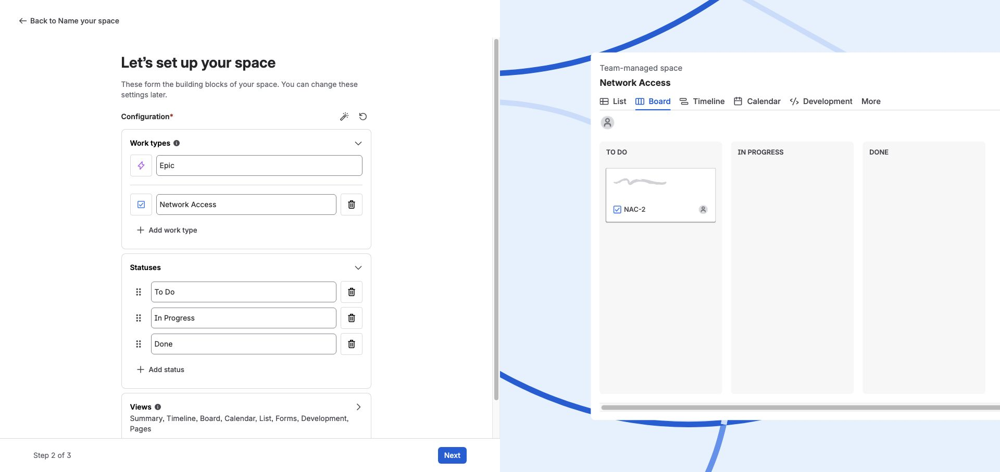
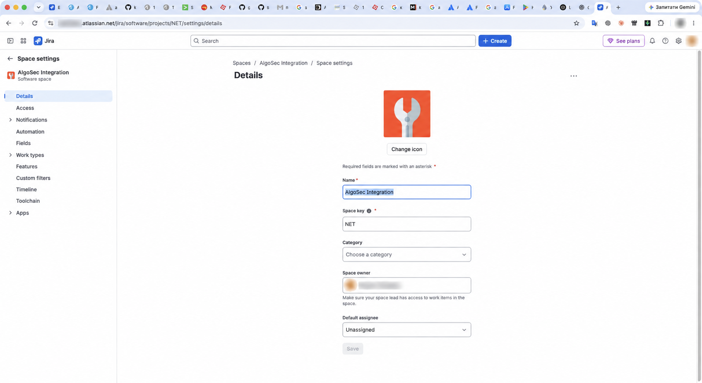
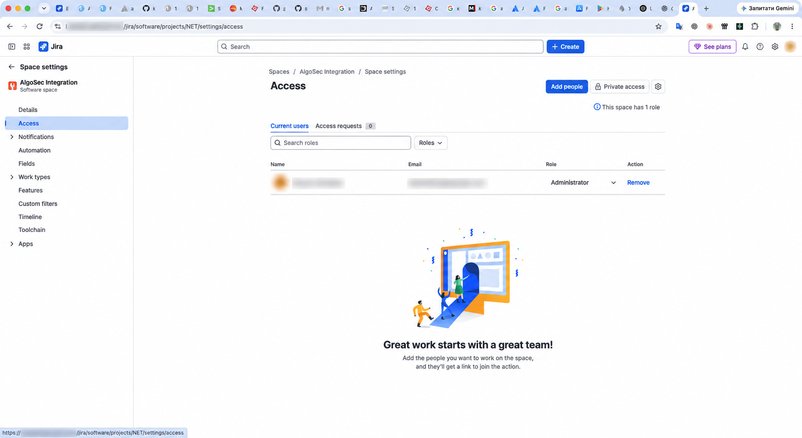

# Встановлення Jira–FireFlow Bus на Linux

Шина є самодостатньою: вона напряму працює з Jira Cloud REST API та AlgoSec FireFlow API.
Вхідних портів немає. Потрібні лише DNS і вихідний HTTPS/443 до двох дозволених адрес.



## 1. Підготуйте доступи

Створіть окремі технічні accounts для інтеграції. Не використовуйте особистий account або
повні Jira/ASMS administrator roles. Обмежте Jira account одним інтеграційним project і
потрібними workflow transitions, а FireFlow account — конкретними template та devices.

### Jira Cloud API token

1. Увійдіть під технічним Atlassian account.
2. Відкрийте [Atlassian Account → Security → API tokens](https://id.atlassian.com/manage-profile/security/api-tokens).
3. Натисніть **Create API token**, задайте зрозумілу назву та строк дії.
4. Скопіюйте token у password manager. Після закриття сторінки його повторно не покажуть.
5. У майстрі вкажіть tenant як `https://your-tenant.atlassian.net`, email технічного
   account і створений token.

Ця версія використовує tenant URL та Basic auth з API token. Scoped token через
`api.atlassian.com/ex/jira/{cloudId}` у майстрі не підтримується.

Guided installer сам перевіряє, чи встановлений сумісний Forge app. Він читає з Jira перелік
полів модуля `algosec-network-access`, показує середовище, field ID та App UUID і дає вибрати
наявний production app або створити новий. Для наявного production app Forge-етап повністю
пропускається. Наведений нижче ручний спосіб потрібен лише без `--guided`:

```sh
git clone --branch v0.3.13 --depth 1 https://github.com/kdimiter/jira-fireflow-bus.git
cd jira-fireflow-bus
cd forge
npm ci --ignore-scripts
cd ..
sh scripts/setup-forge.sh
```

Рекомендований `prepare-jira.sh` створює або знаходить **company-managed** Space, додає вибраний
standard work type, потрібні поля й окремі work type, screen, field-configuration та workflow
schemes через Jira API. Окрема work type scheme містить лише вибраний інтеграційний тип. Для
нього helper створює Basic workflow `To Do → Plan → Approve → Implement → Validate → Match → Done` з
альтернативними кінцевими статусами `Rejected` і `Cancelled`. `Review` не входить до Basic:
цей етап використовується у FireFlow Multi-Approval і Parallel-Approval. Якщо політика замовника
вимагає ручного **team-managed** project, використайте візуальний додаток А після встановлення
Forge app.

### Ручне створення полів Jira

Для форми **Create → Network Access** потрібно чотири custom fields: одне структуроване Forge-поле та три текстові поля результату. Поля всередині форми — обґрунтування, Allow/Drop, джерело, призначення, протокол і порт — є частинами **одного object-поля «Мережеві доступи AlgoSec»**. Не створюйте для них окремі стандартні Jira-поля: поточна шина читає `trafficLines` зі структурованого об’єкта. `Summary` залишається стандартним заголовком Jira.


| Точна назва | Тип | Хто заповнює | Required |
|---|---|---|---|
| Мережеві доступи AlgoSec | Forge custom field, `object`; module key `algosec-network-access` | Заявник через форму застосунку | Так |
| FireFlow Request ID | Short text / Text field (single line), API `string` | Шина: номер створеної заявки FireFlow | Ні |
| FireFlow Status | Short text / Text field (single line), API `string` | Шина: точний статус FireFlow | Ні |
| FireFlow Owner | Short text / Text field (single line), API `string` | Шина: власник заявки FireFlow | Ні |

Назва першого результатного поля — саме **FireFlow Request ID**, а не скорочене «FireFlow ID». Owner є текстом, не Jira User picker і не Assignee. Status є текстом, не списком статусів workflow. У company-managed Jira точний API-тип усіх трьох результатних полів — `com.atlassian.jira.plugin.system.customfieldtypes:textfield`; саме його створює `prepare-jira.sh`. Уже наявні поля правильного типу використовуйте повторно.

#### 1. Встановіть Forge-форму

На адміністративній робочій станції потрібні Node.js 22, npm, Forge CLI та акаунт із правами розгортання Forge і встановлення застосунку на потрібний Jira site. Runtime API-token шини для цього не використовується.

```sh
git clone --branch v0.3.13 --depth 1 https://github.com/kdimiter/jira-fireflow-bus.git
cd jira-fireflow-bus
npm install --global @forge/cli
sh scripts/setup-forge.sh
```

Якщо перевірений checkout уже є, починайте з його кореня. Скрипт копіює Forge-код у `~/algosec-jira-forge`, встановлює npm-залежності, виконує `forge login` та за першого запуску `forge register`. Введіть власний Jira hostname, наприклад `your-tenant.atlassian.net`; виберіть environment `production` для робочого застосунку. Після `forge deploy` скрипт виконує `forge install`, а для наявної інсталяції того самого environment — `forge install --upgrade`. Реєстраційний app ID у публічному `forge/manifest.yml` є шаблоном; його замінює реєстрація вашої робочої копії. Збережіть цю копію для оновлень і не реєструйте другий app для кожного простору.

Маніфест оголошує `jira:customField` із `type: object`, а не `jira:customFieldType`: після встановлення використовуйте створене застосунком поле. Звичайне текстове поле з такою самою назвою не відобразить мережеву форму. [Atlassian: Forge custom field](https://developer.atlassian.com/platform/forge/manifest-reference/modules/jira-custom-field/).

#### 2. Додайте Forge-поле до Network Access

Для **team-managed** простору, як на ілюстраціях:

1. Відкрийте **меню ⋯ біля назви простору → Space settings → Fields → Add fields**.
2. Знайдіть наявне **Мережеві доступи AlgoSec** та додайте його до простору. Якщо у розкладці є посилання **Go to the Fields page**, воно веде до цього кроку. Не натискайте Create field для повторного створення Forge-поля.
3. Перейдіть у **Space settings → Work types → Network Access**. У правій панелі Fields знайдіть додане поле та перетягніть його в **Description fields**. Натисніть **Save changes**.
4. Відкрийте властивості поля в розкладці, увімкніть **Required** і знову збережіть зміни. Поле має бути видимим у формі створення.

Розкладка й додавання наявних полів описані в [Atlassian: поля team-managed простору](https://support.atlassian.com/jira-software-cloud/docs/customize-an-issues-fields-in-team-managed-projects/). Якщо поле не знайдено, перевірте site/environment установленого Forge app та глобальний список полів під Jira administrator; порожній список не виправляється створенням однойменного Short text.

Для **company-managed** проєкту Jira administrator відкриває **Settings → Work items → Screens → потрібний екран → ⋯ → Configure** і додає **Мережеві доступи AlgoSec** через **Select field**. Перевірте екрани Create/Edit/View, які screen scheme призначає саме типу Network Access, і контекст поля для цього проєкту/типу. Після цього розмістіть поле в основній частині work item layout. [Atlassian: налаштування екранів](https://support.atlassian.com/jira-cloud-administration/docs/add-a-custom-field-to-a-screen).

`prepare-jira.sh` повертає точне `issue_layout.url` для створеного екрана, а guided installer
показує його окремим обов'язковим кроком. Відкрийте посилання, перенесіть
**Мережеві доступи AlgoSec** до **Description fields**, залиште **FireFlow Request ID**,
**FireFlow Status** і **FireFlow Owner** у **Context fields**, натисніть **Save changes** і лише
тоді підтвердьте продовження інсталятора. Jira Cloud не публікує REST-операцію для переміщення
між цими секціями; вони налаштовуються окремо для кожного Space, тому helper не використовує
нестабільний `/rest/internal/` endpoint. [Atlassian: work item layout](https://support.atlassian.com/jira-cloud-administration/docs/configure-issue-layout/).

#### 3. Вручну створіть три поля результату

Для **team-managed** простору:

1. Відкрийте **Space settings → Fields → Add fields → Create field**. У показаній старішій розкладці той самий початок доступний через **Work types → Network Access → Create a field**.
2. Виберіть **Short text**, задайте назву **FireFlow Request ID** і натисніть **Create**. Не задавайте початкове значення і не вмикайте Required.
3. Повторіть крок для **FireFlow Status**, потім для **FireFlow Owner** — кожного разу тип **Short text**.
4. У **Work types → Network Access** перетягніть кожне поле з панелі Fields до дозволеної Jira області розкладки та натисніть **Save changes**. Для полів результату допустимо **Hide when empty**; вони з’являться після запису шиною.

Для **company-managed** проєкту:

1. Під Jira administrator відкрийте **Settings → Work items → Fields → Create new field**. У старішій навігації: **Settings → Issues → Custom fields → Create custom field**.
2. Виберіть **Short text / Text field (single line)**, введіть **FireFlow Request ID** і натисніть **Create**. Повторіть для **FireFlow Status** та **FireFlow Owner**.
3. Додайте поля на відповідні екрани через **Work items → Screens → ⋯ → Configure → Select field**; перевірте їхній контекст для проєкту та Network Access. Залиште всі три Optional.

[Atlassian: ручне створення глобального поля](https://support.atlassian.com/jira-cloud-administration/docs/create-a-custom-field/). Назви меню залежать від доступної у tenant навігації. `prepare-jira.sh` автоматизує company-managed варіант; він не створює Forge object-поле і відхиляє team-managed проєкт.

#### 4. Знайдіть customfield IDs і прив’яжіть їх до шини

Під Jira administrator відкрийте глобальний список **Settings → Work items → Fields** та звірте чотири назви, типи й область застосування. Щоб отримати API-ідентифікатори до конфігурації шини, відкрийте у браузері з активною Jira-сесією `https://your-tenant.atlassian.net/rest/api/3/field`. Знайдіть кожний об’єкт за `name` і запишіть його `id` у форматі `customfield_12345`. Для Forge перевірте `schema.type = object` і завершення `schema.custom` на `/static/algosec-network-access`; для решти — `schema.type = string`. За однакових назв перевірте app/environment і контекст, а не вибирайте перший збіг. [Atlassian: API переліку полів](https://developer.atlassian.com/cloud/jira/platform/rest/v3/api-group-issue-fields/).

На вже налаштованому й запущеному Docker deployment ті самі назви, ID та API-типи можна прочитати без виведення токена:

```sh
sudo docker exec algosec-jira-bus python /usr/local/libexec/algosec-jira-bus-scheduler.py fields --like AlgoSec
sudo docker exec algosec-jira-bus python /usr/local/libexec/algosec-jira-bus-scheduler.py fields --like FireFlow
```

Для налаштування Docker виконайте `sudo bus_conf`; для першої інсталяції запустіть `.run` після підготовки полів. Майстер повторно запитає актуальні credentials, ключ проєкту й work type ID. Потім він шукає поле за точною назвою та API-типом: `object` для Forge, `string` для результатів. Коли потрібен ручний вибір, введіть перевірений `customfield_...`. Потрібні **чотири різні ID**. Успішний автоматичний збіг за назвою не замінює перевірку контексту поля.

За ручного редагування змінюйте лише відповідні частини наявного `bus.json`; нижче наведено **фрагмент, не повний конфігураційний файл**:

```json
{
  "mapping": {
    "structured": { "field": "customfield_10000" }
  },
  "mirror": {
    "result_fields": {
      "id": "customfield_10001",
      "status": "customfield_10002",
      "owner": "customfield_10003"
    }
  }
}
```

Усі числа тут умовні. Замініть їх ID власного tenant; збережіть інші параметри mapping, mirror, JQL і workflow. Файл Docker: `/opt/algosec-jira-docker/config/bus.json`; native: `/etc/algosec-jira-bus/bus.json`. Збережіть власника й режим 0600. Першу перевірку виконуйте з `apply: false`; на чинному deployment узгодьте зміну й зупиніть writer перед ручним редагуванням.

#### 5. Required, права і перевірка doctor

У team-managed позначте тільки Forge-поле **Required** у розкладці Network Access. Для company-managed перевірте **Settings → Work items → Field configurations → конфігурація Network Access → Configure**: для Forge встановіть Required, для трьох результатних полів — Optional. Переконайтеся, що відповідна field configuration scheme призначена цьому проєкту й типу. Не змінюйте спільну конфігурацію інших типів без перевірки її області застосування. [Atlassian: конфігурації полів](https://support.atlassian.com/jira-cloud-administration/docs/add-edit-and-delete-a-field-configuration/).

Адміністратор налаштування має права керувати застосунком, полями й проєктом. Runtime Jira-account потребує доступу до Jira і проєкту, читання заявок/полів, редагування трьох полів результату, додавання коментарів і виконання потрібних переходів; права Resolve потрібні лише якщо їх вимагає workflow. У team-managed перевірте роль у **Space settings → Access**, у company-managed — permission scheme. Позначка Required або приховування порожнього поля не обмежує права його редагування.

Майстер сам запускає `doctor` до пропозиції `START`. Для вже налаштованого Docker:

```sh
sudo docker exec algosec-jira-bus python /usr/local/libexec/algosec-jira-bus-scheduler.py doctor
```

`doctor` читає API та перевіряє конфігурацію; він не створює заявки й не доводить можливість запису в усі result fields. За порожнього JQL також немає реальної заявки для перевірки переходів. Розберіть FAIL/WARN до активації, потім у dry-run перевірте одну погоджену заявку: **Create → ваш Space → Network Access**, мережеву форму і збережені значення. Порожнє Required Forge-поле має блокувати створення; три порожні поля результату — не блокувати. Після погодженого `START` перевірте заповнення FireFlow Request ID/Status/Owner та відсутність повторного створення. Цей тест завершує перевірку, яку один `doctor` виконати не може.

### AlgoSec FireFlow API account

Для нового середовища `prepare-fireflow.sh` через HTTPS API створює `jira_bus_api` з правами,
перевіреними в пілоті: ASMS Admin, FireFlow Admin і `ALL_FIREWALLS → Standard`. Він приховано
питає credentials чинного ASMS administrator і двічі — новий унікальний пароль інтеграції.
Згенеруйте пароль у password manager: helper не показує та не записує його у журнали.
SSH або локальний запуск на AlgoSec не потрібні.

## 2. Docker: найпростіше встановлення

Підтримується Linux `amd64`/`x86_64`. Release asset уже містить готовий image і всі runtime
dependencies; на server нічого не компілюється і не збирається.

### 2.1. Встановіть Docker Engine

На чистому сервері перевірте ОС та архітектуру:

```sh
cat /etc/os-release
test "$(uname -m)" = x86_64
getent hosts your-tenant.atlassian.net
getent hosts asms.example.com
```

Дозвольте вихідний TCP/443 до Jira, FireFlow, `github.com`, `download.docker.com` і package
repositories ОС. Вхідні порти для шини не потрібні.

Файл `*-docker-amd64.run` сам визначає Ubuntu/Debian або RHEL/Rocky/AlmaLinux. Якщо на
чистому server немає залежностей, він встановлює `ca-certificates`, `curl`, `python3`, Docker
Engine, CLI та `containerd` з офіційного Docker repository, вмикає `docker.service` і перевіряє
daemon. Команди відповідають поточним офіційним інструкціям Docker для
[Ubuntu](https://docs.docker.com/engine/install/ubuntu/) та
[RHEL](https://docs.docker.com/engine/install/rhel/). Якщо Docker уже встановлений, installer
не змінює його repository або packages.

`install.sh` із source checkout для Docker не потрібен. Запускайте release‑файл `.run`: у ньому
вже є bootstrap, перевірений image, setup wizard і container helper.

### 2.2. Завантажте й запустіть один installer

Відкрийте [останній GitHub Release](https://github.com/kdimiter/jira-fireflow-bus/releases/latest)
і завантажте два assets зі стабільними назвами:

- `algosec-jira-bus-latest-docker-amd64.run`
- `algosec-jira-bus-latest-docker-amd64.run.sha256`

У каталозі із завантаженими файлами:

```sh
sudo install -d -o "$USER" -g "$(id -gn)" /opt/algosec-install
cd /opt/algosec-install

curl -fLO https://github.com/kdimiter/jira-fireflow-bus/releases/latest/download/algosec-jira-bus-latest-docker-amd64.run
curl -fLO https://github.com/kdimiter/jira-fireflow-bus/releases/latest/download/algosec-jira-bus-latest-docker-amd64.run.sha256
sha256sum -c algosec-jira-bus-latest-docker-amd64.run.sha256
sudo sh algosec-jira-bus-latest-docker-amd64.run --guided
```


Режим `--guided` показує термінальні діалогові вікна і проводить через усі етапи на
Linux-сервері. Спочатку він читає із Jira сумісні Forge apps і показує меню: кожен
встановлений app із середовищем, field ID та App UUID або створення нового. Вибір production
app пропонує повторно використати його без змін або розгорнути оновлення на той самий App ID
через `forge install --upgrade`. Повторне використання пропускає Node.js, Forge CLI, Forge
token, deploy та install. Для нового app майстер
встановлює Node.js 22 та Forge CLI під звичайним користувачем і виконує register/deploy/install.
Після цього він виконує створення Jira Space і
work type, повної форми Basic network request, трьох полів результату та окремих work type,
screen, field-configuration і workflow schemes, а потім конфігурацію Docker-шини. Окрема work
type scheme містить лише вибраний інтеграційний тип. Автоматичне призначення схем виконується
лише для порожнього Space; якщо заявки вже існують і потрібна міграція, майстер зупиняється.
Створений workflow:

```text
To Do -> Plan -> Approve -> Implement -> Validate -> Match -> Done
```

`Rejected` і `Cancelled` є кінцевими альтернативами. `Review` не додається, тому що не є етапом
Basic workflow. Mac і окремий checkout repository не потрібні.
Jira administrator email і token вводяться один раз та зберігаються лише у тимчасових файлах
із правами `0700/0600` на час discovery і Jira preparation. Вибраний App ID передається в
`prepare-jira.sh`, тому development і production копії однойменного поля не плутаються.

Файл `.sha256` перевіряє цілісність завантаження. Для повної перевірки release також
публікуються `SHA256SUMS`, `RELEASE-MANIFEST.json` і SPDX SBOM. Manifest зв'язує assets та
Docker image ID з точним Git revision; це запис для відстеження походження, а не окремий
цифровий підпис.

Installer повторно перевіряє власний payload та вбудований image перед `docker load`, запускає
майстер і створює container лише після успішного `doctor`. У майстрі введіть Jira tenant,
API email/token, ASMS URL та FireFlow API user/password. Після успішного FireFlow-входу майстер
сам отримує через API всі дозволені й підтримувані FireFlow `device tree names`.

### 2.3. Оновлення живого container без повторного введення секретів

Для оновлення наявної інсталяції, створеної цим installer, спочатку завантажте актуальний
Docker `.run` і сусідній `.sha256`, потім перевірте checksum і запустіть upgrade:

```sh
cd /opt/algosec-install
curl -fLO https://github.com/kdimiter/jira-fireflow-bus/releases/latest/download/algosec-jira-bus-latest-docker-amd64.run
curl -fLO https://github.com/kdimiter/jira-fireflow-bus/releases/latest/download/algosec-jira-bus-latest-docker-amd64.run.sha256

sha256sum -c algosec-jira-bus-latest-docker-amd64.run.sha256
sudo sh algosec-jira-bus-latest-docker-amd64.run --upgrade
```

Режим `--upgrade` не запускає wizard і не переписує `secrets.json` або state. Новий image
завантажується та проходить `doctor` із копією мігрованого `bus.json`, чинними secrets у
read-only mount і тимчасовим state ще до зупинки робочого container. Потім installer зберігає
старий container як rollback, атомарно змінює лише несекретний `bus.json` і чекає повідомлення
`READY: startup doctor passed.` Якщо воно не з'явилося, старий `bus.json` і старий container
відновлюються автоматично.

Після першого такого оновлення доступна команда для наступних релізів:

```sh
sudo bus_update ./algosec-jira-bus-latest-docker-amd64.run \
  ./algosec-jira-bus-latest-docker-amd64.run.sha256
```

Вона перевіряє SHA-256 і запускає `--upgrade` із нового, уже перевіреного installer. Автоматичне
фонове оновлення не виконується: версію й час короткого перезапуску контролює адміністратор.

Для нового середовища спочатку встановіть image та незалежні `.sh` helpers:

```sh
sudo sh algosec-jira-bus-latest-docker-amd64.run --prepare-only
sudo prepare-fireflow.sh --base-url https://ASMS-HOST --apply
sudo create-jira-space.sh --base-url https://TENANT.atlassian.net --space-key ALGO --space-name "AlgoSec" --apply
# Після встановлення repository Forge app:
sudo prepare-jira.sh --base-url https://TENANT.atlassian.net --space-key ALGO --space-name "AlgoSec" --work-type-name "AlgoSec Network Access" --apply
sudo sh algosec-jira-bus-latest-docker-amd64.run
```

FireFlow API автентифікує інтеграцію за **username/password** і видає тимчасовий
`sessionId`; постійний API key для цього способу не потрібен. `prepare-fireflow.sh`
створює обліковий запис, а не статичний токен. Новому локальному користувачу AlgoSec видає
тимчасовий пароль: один раз увійдіть ним у вебінтерфейс FireFlow, задайте постійний пароль і
вже його введіть у `bus_conf`. Повторно запускати створення користувача не потрібно.
Якщо обліковий запис уже створений
вручну, пропустіть цей helper: перевірте права **ASMS Admin**, **FireFlow Admin** та
**ALL_FIREWALLS → Standard**, потім у `sudo bus_conf` введіть FireFlow URL, його
username і password. Jira окремо використовує email та API token.

Для кожної нової заявки шина передає `creator.emailAddress` із Jira у поле FireFlow
**Requestor**, якщо Jira API повертає валідну адресу. Якщо Jira приховує або не повертає
email автора, заявка все одно створюється без поля **Requestor**. Поле **Owner** шина не
задає: його призначає workflow FireFlow.

У підказках `prepare-fireflow.sh`, `prepare-jira.sh` і `bus_conf` працюють `←`/`→`,
Home/End, Backspace з обома поширеними кодами (`BS` і `DEL`), окрема клавіша Delete
та **Ctrl-U** для очищення поточного поля. Паролі й токени відображаються лише
зірочками. Вхід адміністратора перевіряється одразу після його username/password,
до запиту даних нового облікового запису. Невідповідність нового пароля дозволяє
повторити пару до трьох разів.
Команди вище вводьте одним рядком, без завершального `\`. Якщо TLS-перевірка
не проходить, використайте CA-файл або запустіть одним рядком:

```sh
sudo prepare-fireflow.sh --base-url https://ASMS-HOST --trust-server-certificate --apply
```

Перевірте показаний fingerprint перед підтвердженням `TRUST`. Помилки входу окремо
позначають TLS, DNS/мережу, timeout, HTTP 401/403 або неочікувану відповідь API.

Helpers виконують реалізацію всередині готового image і не залежать від host Python.
`create-jira-space.sh` окремо перевіряє доступність ключа й назви та створює
**company-managed** Jira Space з автентифікованим адміністратором як Lead. Команда
ідемпотентна: повторний запуск використовує той самий Space, а конфлікт ключа, іншу назву чи
team-managed Space відхиляє. Без `--apply` виконується лише read-only перевірка. Скрипт запитує
Jira administrator email та API token у терміналі; token показується зірочками. Після створення
Space встановіть repository Forge app, тоді запустіть `prepare-jira.sh`: він створює/знаходить
вказаний standard work type, Forge-поле Basic network request, три result fields, окремі work
type, screen і field-configuration schemes та окремий Basic workflow scheme для цього типу.
Work type scheme містить лише вибраний інтеграційний тип. Автоматичне призначення work type і
workflow schemes виконується лише для порожнього Space; якщо в ньому вже є заявки і потрібна
міграція, helper відмовляється її виконувати. Forge-поле стає
видимим і обов'язковим, а FireFlow Request ID, Status та Owner — видимими й необов'язковими.
Workflow має основний шлях `To Do → Plan → Approve → Implement → Validate → Match → Done` і
кінцеві альтернативи `Rejected` та `Cancelled`; `Review` не входить до Basic. Спільні **Default
Field Configuration** та схеми інших Space не змінюються. Якщо не передавати
назви параметрами, helper послідовно запитає **Jira Space key**, **Jira Space name** і
**Jira work type name**. Обидва Jira helpers приймають `--space-key`/`--space-name`; старі
назви `--project-key`/`--project-name` також підтримуються. Для явного вибору унікального типу
використайте `--work-type-name "AlgoSec Network Access"`. Це усуває конфлікт, якщо tenant уже
містить кілька глобальних work types з назвою `Network Access`; шина надалі використовує
числовий ID вибраного типу.

Опція **Trust server certificate** за замовчуванням вимкнена. У цьому режимі діє повна TLS-
перевірка: довірений ланцюжок CA та відповідність hostname або IP сертифікату. Увімкніть опцію
лише для приватного/self-signed сертифіката FireFlow або підключення за IP, яке не проходить
звичайну перевірку. Тоді CA та hostname перевірки для FireFlow замінюються pin-only перевіркою
точного SHA-256 fingerprint сертифіката сервера. Довільний сертифікат не приймається: після
планового renewal або заміни сертифіката виконайте
`sudo bus_conf --refresh-certificate` і підтвердьте новий fingerprint. При помилці автоматично
повертається попередній pin і робоча конфігурація.

Введення `START` вмикає синхронізацію. Порожня відповідь зберігає `apply: false`.

### 2.4. Повторна конфігурація після встановлення

Щоб змінити налаштування вже встановленого Docker deployment, запустіть:

```sh
sudo bus_conf
```


Майстер щоразу повторно запитує Jira URL, API email/token, ASMS/FireFlow URL та FireFlow API
user/password. Введіть актуальні значення, навіть якщо змінюєте лише один параметр. Майстер не
показує збережені tokens і застосовує нову конфігурацію після перевірки з'єднань.

### 2.5. Jira → FireFlow: коментарі та зміни статусів

Після успішного встановлення викличте окреме меню:

```sh
sudo bus_conf --jira-sync
```

Меню не запитує повторно Jira token або FireFlow password. Воно дозволяє:

1. увімкнути або вимкнути напрямок Jira → FireFlow;
2. увімкнути внутрішні коментарі в FireFlow History;
3. увімкнути зміни статусів;
4. відредагувати мапу у форматі `Jira status=FireFlow status`, розділяючи пари комами.

Приклад для workflow з повторним відкриттям і двома кінцевими станами:

```text
To Do=open, Reopened=open, Done=resolved, Closed=resolved, Cancelled=cancelled
```

Назви ліворуч мають точно відповідати статусам Jira. Значення праворуч — внутрішні статуси
поточного workflow FireFlow у нижньому регістрі. Не додавайте неперевірені переходи: FireFlow
може автоматично просунути заявку далі після встановлення проміжного статусу. Шина підтверджує
саме нову транзакцію зміни статусу в History і окремо записує фактичний поточний статус.
Дозволені лише `open`, `resolved`, `cancelled` і `rejected`. Етапи approve/review/implement/
validate/match навмисно не приймаються з Jira, щоб сервісний акаунт не обходив ролі та
погодження FireFlow.

Під час першого applied poll шина запам'ятовує всі наявні Jira comments і status changes та
нічого з них не надсилає. Лише наступні події копіюються. Коментар записується як **internal
comment**, тому не надсилає correspondence email заявнику. У тексті зберігаються Jira key,
display name автора й час; технічним автором транзакції у FireFlow залишається integration
account. Коментарі з Jira visibility для role/group та внутрішні Jira Service Management
comments не копіюються між різними аудиторіями. Події, які сама шина створила в Jira з даних
FireFlow, мають origin marker і назад не відправляються.

Цей напрямок використовує HTTPS endpoint `/FireFlow/REST/1.0`, оскільки публічний FireFlow API
не має операцій внутрішнього коментаря та зміни статусу. Функція має окремий
`fireflow.legacy_rt_enabled` gate, який меню вмикає разом із синхронізацією. Перевірте її на
версії FireFlow замовника до production activation. За невизначеного результату POST подія
паркується без повторної відправки, щоб не створити дубль.

Переглянути таку подію без виведення тексту коментаря:

```sh
sudo docker exec algosec-jira-bus \
  python /usr/local/libexec/algosec-jira-bus-scheduler.py queue
```

Після ручної перевірки History у FireFlow адміністратор може підтвердити, що операція вже
виконана, і прибрати тільки точно вказану parked-подію. Значення `key`, `stream` та `event_id`
беруться з попередньої команди:

```sh
sudo docker exec algosec-jira-bus \
  python /usr/local/libexec/algosec-jira-bus-scheduler.py \
  ack-jira-update NET-8 comments 12345
```

Команда відмовляється обробляти звичайну retryable-подію або інший event ID.
Для stream `statuses` додатково звірте показаний `target_status` з новою транзакцією Status
у FireFlow History і передайте його точно:

```sh
sudo docker exec algosec-jira-bus \
  python /usr/local/libexec/algosec-jira-bus-scheduler.py \
  ack-jira-update NET-8 statuses 12346 --expected-value resolved
```

Якщо History однозначно підтверджує, що POST **не виконався**, не використовуйте `ack`.
Дозвольте одну контрольовану повторну спробу з новим operation ID:

```sh
sudo docker exec algosec-jira-bus \
  python /usr/local/libexec/algosec-jira-bus-scheduler.py \
  retry-jira-update NET-8 comments 12345
```

Для status додайте той самий `--expected-value`, що показує `queue`. Команда зберігає зв'язок
із попереднім operation ID, лічильник спроб і не видаляє старий receipt. Після успішної зміни
статусу маркер у state забороняє зворотному mirror одразу переводити Jira назад.

Вимкнути напрямок можна тією самою командою. Секрети, основна конфігурація, зв'язки заявок і
state при цьому зберігаються.

### 2.6. Автоматичне встановлення без майстра

На production-сервері ChatGPT, агент і MCP не потрібні. Підготуйте `bus.json` з
`env:JIRA_API_TOKEN` та `env:ASMS_API_PASSWORD`, а також приватний `secrets.json`, який містить
рівно ці два ключі. Потім виконайте:

```sh
sudo install -d -m 0700 /root/jira-fireflow-deploy
sudo install -o root -g root -m 0600 bus.json secrets.json /root/jira-fireflow-deploy/
sudo sh algosec-jira-bus-latest-docker-amd64.run \
  --config-file /root/jira-fireflow-deploy/bus.json \
  --secrets-file /root/jira-fireflow-deploy/secrets.json
```

Файли мають бути regular files, належати `root`, мати один hard link і режим рівно `0600`.
Installer перевіряє їх до `docker load`, запускає `doctor` із тимчасовим state до зупинки
чинного container, атомарно встановлює конфіг і повертає попередній container та config, якщо
новий запуск не вдався.

Якщо FireFlow використовує приватний CA, додайте третій підготовлений файл:

```sh
sudo install -o root -g root -m 0600 fireflow-ca.pem /root/jira-fireflow-deploy/
sudo sh algosec-jira-bus-latest-docker-amd64.run \
  --config-file /root/jira-fireflow-deploy/bus.json \
  --secrets-file /root/jira-fireflow-deploy/secrets.json \
  --ca-file /root/jira-fireflow-deploy/fireflow-ca.pem
```

У `fireflow.base_url` використовуйте FQDN із SAN сертифіката. Членство Linux-сервера в Active
Directory не потрібне: потрібні лише DNS-резолвінг цього FQDN, TCP/443 і довіра до переданого
CA. Варіант із `--ca-file` зберігає повну перевірку CA та hostname; pin-only режим
**Trust server certificate** стосується інтерактивної конфігурації через `sudo bus_conf`.

Перевірка:

```sh
sudo docker ps --filter name=algosec-jira-bus
sudo docker logs --tail 100 algosec-jira-bus
```

Секрети зберігаються на host у
`/opt/algosec-jira-docker/config/secrets.json` (`0600`, UID/GID `10001`). Config монтується
read-only, а state окремо з write access у `/opt/algosec-jira-docker/state`. Container
працює як UID `10001` з read-only root filesystem, `cap-drop ALL` і
`no-new-privileges`.

## 3. Native Linux із systemd

Native installer також самодостатній і не звертається до Python package index. Він потребує
запущений systemd та Python 3.11+.

Ubuntu 24.04+/Debian 12+:

```sh
sudo apt-get update
sudo apt-get install -y ca-certificates python3 python3-venv
python3 -c 'import sys; assert sys.version_info >= (3, 11), sys.version'
```

Rocky Linux 8/9:

```sh
sudo dnf install -y ca-certificates python3.11
python3.11 -c 'import sys, venv; assert sys.version_info >= (3, 11)'
```

З [останнього GitHub Release](https://github.com/kdimiter/jira-fireflow-bus/releases/latest)
завантажте `algosec-jira-bus-latest-linux.run` і сусідній `.sha256`, потім:

```sh
sha256sum -c algosec-jira-bus-latest-linux.run.sha256
sudo sh algosec-jira-bus-latest-linux.run
sudo systemctl status algosec-jira-bus.timer algosec-jira-bus-reconcile.timer
sudo journalctl -u algosec-jira-bus.service -n 100 --no-pager
```

Native secrets: `/etc/algosec-jira-bus/secrets.env`, режим `0600`, власник
`algosec-jira-bus`. Config використовує `env:JIRA_API_TOKEN` і
`env:ASMS_API_PASSWORD`. State, receipts та journal розміщені у
`/var/lib/algosec-jira-bus` (`0700`).

## 4. Перевірка перед увімкненням

1. Перевірте tenant, project, work type, custom fields, template і конкретні devices.
2. Залиште `apply: false` і звузьте JQL до інтеграційного project/work type.
3. Переконайтесь, що `doctor` успішно перевірив TLS, Jira identity, поля, ASMS identity,
   template та devices.
4. Перегляньте один dry-run і journal.
5. Введіть `START` лише після перевірки очікуваної кількості traffic lines та їх digest.

`jira.scan_limit` обмежує кількість issues, прочитаних за poll. `max_per_pass` окремо обмежує
кількість FireFlow requests, які можна створити за один прохід. Оновлення installer не
перезаписує наявні secrets, config або state. Перед оновленням старої інсталяції перенесіть
секрети у відповідний приватний secrets-файл і використовуйте лише посилання
`env:JIRA_API_TOKEN`, `env:ASMS_API_PASSWORD` або інші `env:NAME`: installer відмовиться
зупиняти чинний сервіс, якщо конфігурація містить несумісний спосіб зберігання секретів.

## Додаток А. Візуальна ручна підготовка team-managed Jira

Цей додаток потрібен лише тоді, коли Jira administrator свідомо обирає ручний
**team-managed** project замість автоматичного `prepare-jira.sh`. Назви пунктів Jira можуть
змінюватися. На знімках залишені стандартні назви об'єктів; tenant, email, ім'я та аватари
приховані. Значення `Network Access`, `NAC`, `AlgoSec Integration` і `NET` є прикладами.

### А.1. Створіть project

У Jira відкрийте **Spaces → Create space**, виберіть Kanban і натисніть **Use template**.



Виберіть **Team-managed**. Для production оберіть доступ відповідно до політики замовника;
для інтеграційного project зазвичай використовується **Private**.



Вкажіть власні Name і Key. Не копіюйте `NAC`, якщо цей key уже використовується.



### А.2. Залиште потрібний work type

На кроці **Work types** залиште або створіть `Network Access`. Sample work items можна
вимкнути, щоб тестові записи не потрапили під JQL шини.



Початкові стандартні статуси можна залишити лише на час створення project.



До запуску шини додайте статуси `Plan`, `Approve`, `Implement`, `Validate`, `Match`, `Rejected`
і `Cancelled`, залишивши також `To Do` та `Done`. Створіть переходи
з такими самими назвами з будь-якого статусу до відповідного цільового статусу. Саме ці
назви використовує `examples/jira-sync-basic-structured.json`; без них зворотне оновлення
статусів із FireFlow не працюватиме. Якщо team-managed project не дозволяє відтворити цю
схему, використайте company-managed project і `prepare-jira.sh`. Не додавайте `Review` для
Basic network request: цей статус потрібен лише Multi-Approval та Parallel-Approval workflows.

### А.3. Перевірте Details і Access

Відкрийте **Space settings → Details** і звірте Name та Key з тим, що вводитимете у
`bus_conf`. Особисті дані на наступному знімку заблюрені.



У **Space settings → Access** додайте технічний Jira account. Йому потрібні Browse, Edit,
Add Comments і Transition для цільового work type; глобальні Jira administrator права для
runtime не потрібні.



Після цього встановіть Forge field, додайте три текстові result fields, зробіть structured
field обов'язковим і запустіть installer. `doctor` має побачити project, work type, усі поля
та дозволені transitions до введення `START`.
