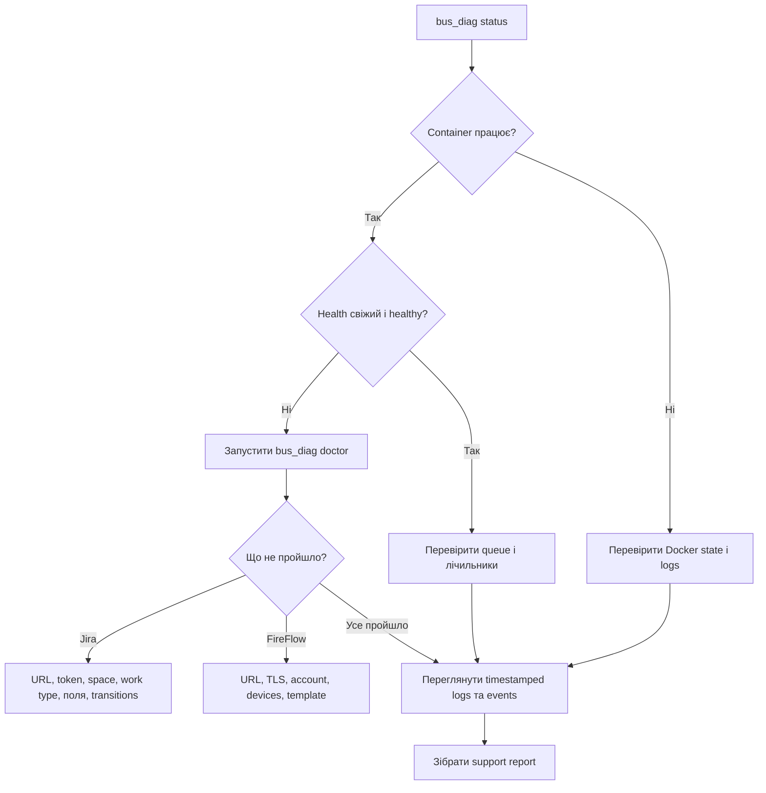

# Експлуатація, діагностика та налагодження

Цей runbook призначений для адміністратора Docker-інсталяції шини Jira–FireFlow. Він описує,
як підтвердити роботу планувальника, знайти несумісність після оновлення Jira або FireFlow,
перевірити чергу повторних спроб і підготувати звіт для підтримки.

Типовий каталог постійних даних — `/opt/algosec-jira-docker`. Якщо під час інсталяції вказали
інший каталог, його точний шлях записаний у `/etc/algosec-jira-bus-docker.path`. Не редагуйте
файли в `state/` вручну.

## Перевірка за п’ять хвилин

Виконайте команди послідовно:

```sh
sudo bus_diag status
sudo bus_diag doctor
sudo bus_diag logs 200
sudo bus_diag events 200
```

Ознаки справної роботи:

- container має стан `running`, а Docker показує `health=healthy`;
- у `health.json` записано `status: "healthy"` і свіжий `updated_at_utc`;
- `doctor` завершується рядком `0 failed`;
- у журналі є `READY: startup doctor passed.` і свіжі `Poll finished: exit=0`;
- у черзі немає неочікуваних операцій зі станом `parked`.

Стан `healthy` підтверджує, що планувальник нещодавно завершив перевірки. Він не доводить, що
кожна Jira-заявка валідна або що кожен FireFlow-запит дійшов потрібного бізнес-етапу. Для
окремої заявки перевіряйте журнал подій і пов’язані записи в обох системах.



## Діагностичні команди

| Команда | Що читає | Коли використовувати |
|---|---|---|
| `sudo bus_diag status` | Стан container, Docker health, `health.json`, незавершена черга | Перша команда під час будь-якого інциденту |
| `sudo bus_diag doctor` | Актуальні read-only перевірки Jira, FireFlow, mapping, workflow і TLS | Після зміни системи, credentials, certificate, template, поля або workflow |
| `sudo bus_diag logs 200` | Останні 200 рядків container output із часом | Startup, timeout, exception і результат проходу |
| `sudo bus_diag events 200` | Постійний очищений журнал бізнес-подій | Простежити Jira key або FireFlow request між проходами |
| `sudo bus_diag report` | Status, doctor, events і logs | Один зведений звіт у terminal |
| `sudo bus_diag collect` | Той самий звіт у приватному файлі | Додати докази до внутрішнього звернення в підтримку |

`logs` та `events` приймають від 1 до 5000 рядків. Для перегляду за період використовуйте
Docker безпосередньо:

```sh
sudo docker logs --since 30m --timestamps algosec-jira-bus
```

## Постійні файли та ротація

За типової інсталяції на host зберігаються:

```text
/opt/algosec-jira-docker/state/health.json
/opt/algosec-jira-docker/state/jira-bus.jsonl
/opt/algosec-jira-docker/state/audit.jsonl
```

- `health.json` — останній heartbeat планувальника з результатами doctor, poll і reconcile,
  UTC-часом, тривалістю, exit code та run ID.
- `jira-bus.jsonl` — постійний очищений журнал бізнес-подій.
- `audit.jsonl` — operation receipts, які захищають від дублювання змін після неоднозначної
  відповіді або перезапуску.

Кожен JSONL-файл обмежений 8 МіБ і має до десяти копій (`.1`–`.10`). Docker output має три
файли по 10 МіБ. Читайте його через `docker logs`: внутрішній шлях Docker не є стабільним
інтерфейсом, і його не можна редагувати.

## Як читати результат планувальника

Кожна дія створює пару структурованих записів:

```json
{"action":"poll","event":"action_started","run_id":"...","time_utc":"..."}
{"action":"poll","duration_seconds":12.4,"event":"action_finished","exit_code":0,"level":"info","run_id":"...","time_utc":"..."}
```

Однаковий `run_id` пов’язує початок і завершення. Якщо завершення немає, container зупинився,
процес був примусово завершений або дія ще виконується. Ліміт часу для автоматичного startup
doctor і кожного poll — п’ять хвилин, для reconcile — десять хвилин.

Після poll виводяться лічильники:

| Лічильник | Значення |
|---|---|
| `created` | Нові FireFlow-запити, створені з Jira |
| `skipped` | Уже відомі заявки або заявки без потрібної дії intake |
| `refused` | Jira-заявки, відхилені через перевірку вхідних даних або mapping |
| `failed` | Операції, що завершилися помилкою в цьому проході |
| `deferred` | Робота, збережена для наступної спроби або проходу |
| `capped` | Jira-заявки, залишені на наступний прохід через ліміт створення |
| `mirrored` | Спостереження FireFlow, записані назад у Jira |
| `parked` | Робота, яка потребує оператора після вичерпання спроб або неоднозначного результату |
| `pending` | Збережена, але ще не завершена доставка |
| `missing_ids` | Створений запит, для якого ще немає FireFlow ID |
| `applied` | `true` означає, що запис у системи увімкнений |

`WARN jira.jql ... 0 issue(s)` може бути нормальним, якщо немає заявок для обробки. Ненульові
`refused`, `failed`, `parked`, `pending` або `missing_ids` потребують перевірки.

## Після оновлення Jira або FireFlow

Збережіть докази до й після вікна обслуговування:

```sh
sudo bus_diag collect /var/tmp/jira-fireflow-before-upgrade.txt
# Виконайте оновлення системи.
sudo bus_diag doctor
sudo bus_diag collect /var/tmp/jira-fireflow-after-upgrade.txt
sudo diff -u /var/tmp/jira-fireflow-before-upgrade.txt /var/tmp/jira-fireflow-after-upgrade.txt
```

У doctor перевірте, чи не змінилися authentication, field IDs, work type, transitions,
FireFlow template, доступні device trees, URL path або TLS certificate. Потім створіть одну
контрольовану тестову заявку в Jira та підтвердьте появу FireFlow request і оновлення Jira
comment/status history.

## Типові несправності

### Container зупинений або перезапускається

```sh
sudo docker ps -a --filter name=algosec-jira-bus
sudo docker inspect algosec-jira-bus --format 'state={{.State.Status}} exit={{.State.ExitCode}} restarts={{.RestartCount}} error={{.State.Error}}'
sudo docker logs --timestamps --tail 300 algosec-jira-bus
```

Не видаляйте container або state до збору журналів. Помилка startup doctor навмисно блокує
початок синхронізації.

### Docker показує `unhealthy`

```sh
sudo bus_diag status
sudo bus_diag doctor
```

Health probe локальний і не створює API-запитів. Стан стає `unhealthy`, якщо остання дія
завершилася помилкою або heartbeat старший за 15 хвилин. Під час першого запуску Docker може
показувати `starting` до 330 секунд, поки працює startup doctor.

### Не проходить Jira authentication або mapping

Запустіть `sudo bus_diag doctor` і виконайте рекомендацію невдалої перевірки. Перевірте Jira
site URL, integration email/token, space key, work type ID, structured field ID і transitions.
Змінюйте конфігурацію через `sudo bus_conf`; не редагуйте `bus.json` чи `secrets.json` вручну.

### Не проходить FireFlow authentication, template, devices або TLS

Перевірте мережеву доступність із Linux-host і запустіть `sudo bus_diag doctor`. FireFlow URL,
account, template та підтримувані devices змінюйте через `sudo bus_conf`. Якщо certificate
дійсно планово замінили, звірте новий fingerprint і виконайте:

```sh
sudo bus_conf --refresh-certificate
sudo bus_diag doctor
```

Не оновлюйте pin, доки власник системи не підтвердить заміну certificate.

### Одна заявка постійно має `refused`

```sh
sudo bus_diag events 500 | grep 'PROJECT-123'
sudo bus_diag logs 500 | grep 'PROJECT-123'
```

`refused` зазвичай означає проблему в даних форми, mapping або attribution. Виправте заявку
або конфігурацію: перезапуск container не виправляє невалідні дані.

### Jira створила work item, але FireFlow request не з’явився

Знайдіть Jira key у `events` і `logs`. Якщо його немає, через `bus_diag doctor` перевірте JQL,
space, work type і Jira status. Для `refused` перевірте значення structured field у Jira та
причину в журналі. Для `created` візьміть записаний FireFlow request ID і перевірте саме його,
не створюючи Jira-заявку повторно.

### FireFlow змінився, але Jira status або comments не оновилися

Перевірте `mirrored`, `failed`, `pending` і `parked` в останньому poll та queue. Порівняйте
FireFlow request ID у Jira з ID у журналі. Якщо після зміни Jira workflow не проходить перевірка
transition, виправте mapping через `bus_conf`: перезапуски container не створять відсутній
Jira transition.

### Робота перейшла в `parked`

Спочатку перегляньте `sudo bus_diag status`, пов’язану Jira-заявку, FireFlow request і operation
receipts. Не повторюйте неоднозначне створення, доки не підтвердите, чи існує запит у FireFlow.

Для звичайної parked-операції, яку безпечно повторити:

```sh
sudo docker exec algosec-jira-bus \
  python /usr/local/libexec/algosec-jira-bus-scheduler.py release PROJECT-123
```

Для Jira-to-FireFlow comments і statuses діють суворіші команди. Використайте точні issue,
stream, event ID і target із `bus_diag status`:

```sh
# Операція вже є у FireFlow: підтвердити й прибрати її з черги.
sudo docker exec algosec-jira-bus \
  python /usr/local/libexec/algosec-jira-bus-scheduler.py \
  ack-jira-update PROJECT-123 comments 123456

# Операції немає у FireFlow: дозволити одну нову спробу.
sudo docker exec algosec-jira-bus \
  python /usr/local/libexec/algosec-jira-bus-scheduler.py \
  retry-jira-update PROJECT-123 statuses 123456 --expected-value rejected
```

## Support report і конфіденційність

```sh
sudo bus_diag collect
sudo ls -l /var/tmp/algosec-jira-bus-diagnostics-*.txt
```

Звіт створюється з mode `0600` і ніколи не перезаписує наявний шлях. Діагностичний код не
додає налаштовані паролі або API tokens. Водночас звіт містить Jira keys, FireFlow request IDs,
назви полів і devices, системні URL, робочі identities та очищені тексти помилок. Перегляньте
файл перед передаванням за межі команди підтримки.

Ніколи не додавайте `secrets.json`, `bus.json`, state snapshots, необроблені operation receipts
або неперевірені screenshots до публічного issue.
