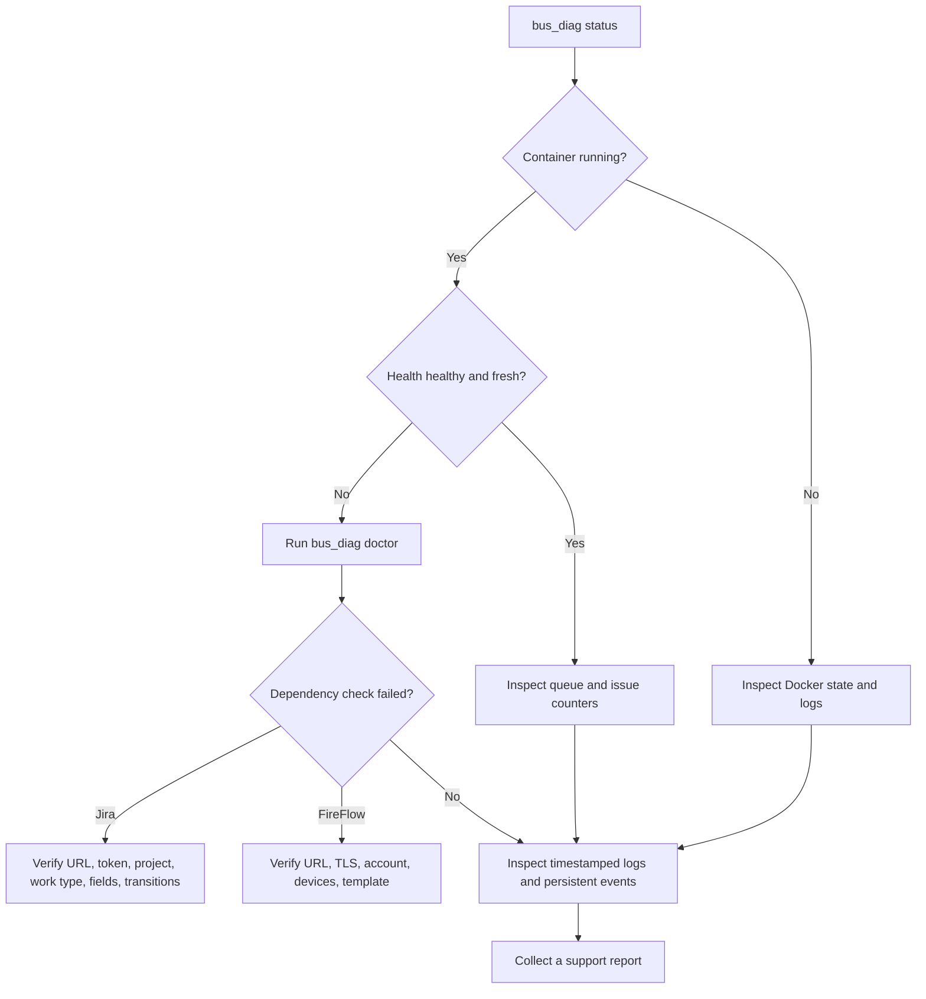

# Operations, diagnostics, and troubleshooting

This runbook is for the administrator who operates the Docker installation of the Jira–FireFlow
bus. It explains how to prove that the scheduler is running, isolate a Jira or FireFlow
compatibility failure after an upgrade, inspect retry state, and prepare a support report.

The default persistent data directory is `/opt/algosec-jira-docker`. An installation may use a
different directory; the authoritative path is stored in
`/etc/algosec-jira-bus-docker.path`. Do not edit files under `state/` by hand.

## Five-minute health check

Run these commands in order:

```sh
sudo bus_diag status
sudo bus_diag doctor
sudo bus_diag logs 200
sudo bus_diag events 200
```

Expected healthy evidence:

- the container is `running` and Docker reports `health=healthy`;
- `health.json` has `status: "healthy"` and a recent `updated_at_utc`;
- `doctor` finishes with `0 failed`;
- the log contains `READY: startup doctor passed.` and recent `Poll finished: exit=0` lines;
- the queue has no unexpected `parked` work.

`healthy` proves that the scheduler recently completed its checks. It does not prove that every
Jira request is valid or that every FireFlow request reached its expected business state. Use the
event journal and the linked Jira/FireFlow request when investigating one work item.



## Diagnostic commands

| Command | What it reads | When to use it |
|---|---|---|
| `sudo bus_diag status` | Container state, Docker health, `health.json`, unfinished queue | First command for every incident |
| `sudo bus_diag doctor` | Live read-only Jira, FireFlow, mapping, workflow and TLS checks | After a system, credential, certificate, template, field, or workflow change |
| `sudo bus_diag logs 200` | Last 200 timestamped container output lines | Scheduler startup, timeouts, exceptions and pass results |
| `sudo bus_diag events 200` | Persistent redacted business-event journal | Follow one Jira key or FireFlow request across passes |
| `sudo bus_diag report` | Status, doctor, events and logs | One combined terminal view |
| `sudo bus_diag collect` | The same combined report in an owner-only file | Attach evidence to an internal support case |

`logs` and `events` accept from 1 to 5000 lines. For a time window, use Docker directly:

```sh
sudo docker logs --since 30m --timestamps algosec-jira-bus
```

## Persistent files and retention

With the default data directory, the host stores:

```text
/opt/algosec-jira-docker/state/health.json
/opt/algosec-jira-docker/state/jira-bus.jsonl
/opt/algosec-jira-docker/state/audit.jsonl
```

- `health.json` is the latest scheduler heartbeat. It contains the last doctor, poll and
  reconciliation result, UTC time, duration, exit code and run ID.
- `jira-bus.jsonl` is the persistent redacted business-event journal.
- `audit.jsonl` contains durable operation receipts used to avoid duplicate changes after an
  ambiguous response or restart.

The JSONL files are limited to 8 MiB with ten backups (`.1` through `.10`). Docker output is
limited to three 10 MiB files. Read Docker output with `docker logs`; its internal path is an
implementation detail of Docker and must not be edited.

## Reading scheduler output

Every action emits paired structured records:

```json
{"action":"poll","event":"action_started","run_id":"...","time_utc":"..."}
{"action":"poll","duration_seconds":12.4,"event":"action_finished","exit_code":0,"level":"info","run_id":"...","time_utc":"..."}
```

The same `run_id` joins the start and finish records. A missing finish record normally means the
container stopped, the process was killed, or the action is still running. The scheduler limits
the automatic startup doctor and each poll to five minutes, and reconciliation to ten minutes.

A completed poll prints counters:

| Counter | Meaning |
|---|---|
| `created` | New FireFlow requests created from Jira |
| `skipped` | Requests already known or requiring no intake action |
| `refused` | Jira requests rejected by deterministic input or mapping validation |
| `failed` | Operations that failed during this pass |
| `deferred` | Work retained for a later retry or pass |
| `capped` | Eligible Jira work left for a later pass because the per-pass creation limit was reached |
| `mirrored` | FireFlow observations written back to Jira |
| `parked` | Work requiring operator review after exhausted retries or an ambiguous outcome |
| `pending` | Saved work that has not finished delivery |
| `missing_ids` | A created request whose FireFlow identifier is still unavailable |
| `applied` | `true` means write mode is enabled |

`WARN jira.jql ... 0 issue(s)` may be normal when there is no eligible Jira work. A nonzero
`refused`, `failed`, `parked`, `pending`, or `missing_ids` count needs investigation.

## After a Jira or FireFlow upgrade

Capture evidence immediately before and after the maintenance window:

```sh
sudo bus_diag collect /var/tmp/jira-fireflow-before-upgrade.txt
# Perform the vendor upgrade.
sudo bus_diag doctor
sudo bus_diag collect /var/tmp/jira-fireflow-after-upgrade.txt
sudo diff -u /var/tmp/jira-fireflow-before-upgrade.txt /var/tmp/jira-fireflow-after-upgrade.txt
```

Check the doctor output for changed authentication, field IDs, work type, transitions, FireFlow
template, supported device trees, URL path, or TLS certificate. Then create one controlled Jira
test request and verify both the FireFlow request and the Jira comment/status history.

## Common failures

### Container is stopped or restarting

```sh
sudo docker ps -a --filter name=algosec-jira-bus
sudo docker inspect algosec-jira-bus --format 'state={{.State.Status}} exit={{.State.ExitCode}} restarts={{.RestartCount}} error={{.State.Error}}'
sudo docker logs --timestamps --tail 300 algosec-jira-bus
```

Do not delete the container or state directory before collecting the logs. A failed startup doctor
intentionally prevents synchronization from starting.

### Docker reports `unhealthy`

```sh
sudo bus_diag status
sudo bus_diag doctor
```

The health probe is local and sends no API requests. It becomes unhealthy when the latest action
failed or the heartbeat is older than 15 minutes. During initial startup Docker may show
`starting` for up to 330 seconds while the startup doctor runs.

### Jira authentication or mapping fails

Run `sudo bus_diag doctor` and follow the failing check. Verify the Jira site URL, integration
email/token, project key, work type ID, structured field ID, and configured transitions. Use
`sudo bus_conf` to change configuration; never edit `bus.json` or `secrets.json` in place.

### FireFlow authentication, template, device, or TLS fails

Verify network reachability from the Linux host and run `sudo bus_diag doctor`. Update the
FireFlow URL, account, template, or supported devices through `sudo bus_conf`. When the server
certificate was legitimately renewed, review the new fingerprint and run:

```sh
sudo bus_conf --refresh-certificate
sudo bus_diag doctor
```

Do not refresh the pin until the certificate change has been confirmed with the system owner.

### One request is repeatedly refused

```sh
sudo bus_diag events 500 | grep 'PROJECT-123'
sudo bus_diag logs 500 | grep 'PROJECT-123'
```

`refused` is normally an input, form, mapping, or attribution problem. Correct the Jira request or
configuration; restarting the container does not make invalid input valid.

### Jira created the work item, but no FireFlow request appeared

Find the Jira key in `events` and `logs`. If it is absent, check the configured JQL, project/space,
work type and Jira status with `bus_diag doctor`. If it is `refused`, inspect the structured field
value in Jira and the reason in the event. If it is `created`, read the recorded FireFlow request ID
and verify that exact request rather than creating the Jira item again.

### FireFlow changed, but Jira status or comments did not

Check `mirrored`, `failed`, `pending` and `parked` in the latest poll and queue. Compare the
FireFlow request ID stored in Jira with the ID in the event journal. A transition check that fails
after a Jira workflow update must be corrected in `bus_conf`; repeatedly restarting the container
does not repair a missing Jira transition.

### Work is parked

First inspect `sudo bus_diag status`, the linked Jira issue, the FireFlow request, and operation
receipts. Never retry an ambiguous create until you have proved whether FireFlow created it.

For an ordinary parked item that is confirmed safe to retry:

```sh
sudo docker exec algosec-jira-bus \
  python /usr/local/libexec/algosec-jira-bus-scheduler.py release PROJECT-123
```

Jira-to-FireFlow comment and status operations have stricter commands. Use the exact issue,
stream, event ID and target shown by `bus_diag status`:

```sh
# Confirm the operation is already present in FireFlow, then consume it:
sudo docker exec algosec-jira-bus \
  python /usr/local/libexec/algosec-jira-bus-scheduler.py \
  ack-jira-update PROJECT-123 comments 123456

# Confirm the operation is absent in FireFlow, then allow one new attempt:
sudo docker exec algosec-jira-bus \
  python /usr/local/libexec/algosec-jira-bus-scheduler.py \
  retry-jira-update PROJECT-123 statuses 123456 --expected-value rejected
```

## Support report and sensitive data

```sh
sudo bus_diag collect
sudo ls -l /var/tmp/algosec-jira-bus-diagnostics-*.txt
```

The report is created with mode `0600` and never overwrites an existing path. Diagnostic code does
not add configured passwords or API tokens. Reports still contain Jira keys, FireFlow request IDs,
field and device names, system URLs, operational identities, and sanitized error details. Review
the file before sharing it outside the support team.

Never send `secrets.json`, `bus.json`, state snapshots, raw operation receipts, or unreviewed
screenshots to a public issue.
