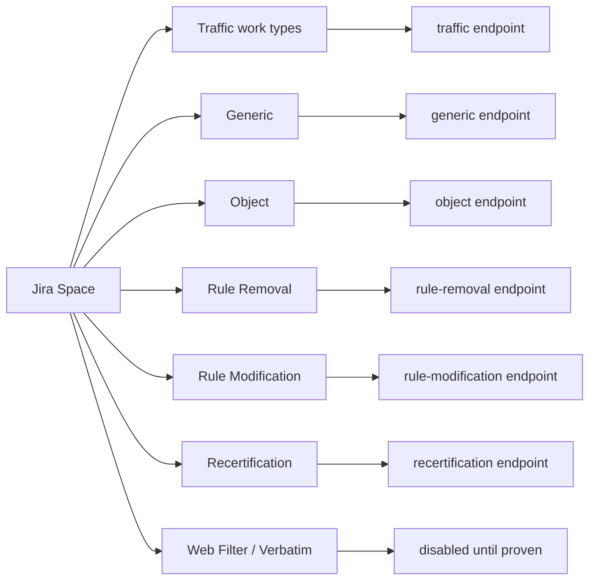

# Шаблони FireFlow, робочі процеси та автоматизація

## Призначення документа

Цей документ описує шаблони FireFlow, які доступні у вихідному середовищі, їхні стандартні робочі процеси, підтримувані REST API та рекомендоване відображення у Jira. Основна мета — розширити Jira–FireFlow Bus новими Work Type у межах одного Jira Space, не змішуючи різні контракти заявок і не вмикаючи автоматичне внесення змін без окремого контрольованого сценарію.

Опис базується на офіційній документації ASMS A33.20, A33.10, A33.00 та A32.60 і на переліку шаблонів, отриманому з FireFlow. Конкретна інсталяція може мати змінені шаблони й workflow. Тому назва шаблону сама по собі не доводить фактичний набір полів, переходів, ролей або можливість ActiveChange. Перед реалізацією кожного нового Work Type потрібна перевірка під обліковим записом шини через `GET /FireFlow/api/templates`, локальний Swagger і одну тестову заявку.[^1][^2]

## Ключові поняття

У FireFlow чотири окремі рівні керують поведінкою заявки:

1. **Request template** визначає форму, обов’язкові поля, попередньо задані значення та прив’язаний workflow.
2. **Workflow** визначає етапи, ролі, дії та переходи між ними.
3. **REST endpoint** визначає технічний формат створення або читання заявки. Однаковий endpoint може приймати різні traffic templates, але Generic, Object, Rule Removal та Rule Modification мають інші контракти.
4. **ActiveChange / Zero Touch** визначає, чи може FireFlow провести розрахунок і внесення змін без ручного виконання. Це залежить від workflow, підтримки виробника й версії пристрою, налаштувань AFA та результатів перевірок ризику.[^3][^4]

Отже, «коротший workflow» означає меншу кількість стандартних етапів або автоматичне проходження етапів. Це не означає, що можна передати звичайну traffic-заявку в інший шаблон без окремої перевірки.

## Зведена матриця

| Шаблон FireFlow | Тип і стандартний workflow | Стандартні етапи | Автоматизація | REST створення | Рекомендований Jira Work Type |
|---|---|---|---|---|---|
| `Standard` | Traffic / Standard | Request → Plan → Approve → Implement → Validate → Match → Resolved → Audit | Ручне погодження; Implement вручну або ActiveChange | `POST /change-requests/traffic` | `Network Access — Standard` |
| `Basic Change Traffic Request` | Traffic / Basic | Request → Plan → Approve → Implement → Validate → Match → Resolved → Audit | Ручне погодження; Implement вручну або ActiveChange | `POST /change-requests/traffic` | Поточний `Network Access` |
| `110: Multi-Approval Request` | Traffic / Multi-Approval | Request → Plan → Approve → Review → Implement → Validate → Resolved → Audit | Послідовні погодження та Review | `POST /change-requests/traffic` | `Network Access — Sequential Approval` |
| `115: Automatic Traffic Change Request` | Traffic / Automatic-Traffic-Change | Request → Plan → Approve → Implement → Validate → Match → Resolved → Audit | Zero Touch за виконання критеріїв; тільки `Allow` | `POST /change-requests/traffic` | `Network Access — Automatic` |
| `150: Parallel-Approval Request` | Traffic / Parallel-Approval | Request → Plan → Approve → Review → Implement → Validate → Resolved → Audit | Паралельні погодження та Review | `POST /change-requests/traffic` | `Network Access — Parallel Approval` |
| `170: Traffic Change Request (IPv6)` | IPv6 Traffic | Request → Plan → Approve → Implement → Validate → Resolved → Audit | Вручну або ActiveChange на підтримуваних пристроях | `POST /change-requests/traffic` | `IPv6 Network Access` |
| `180: Traffic Change Request (Multicast)` | Multicast Traffic | Request → Plan → Approve → Implement → Validate → Resolved → Audit | Вручну або ActiveChange на підтримуваних пристроях | `POST /change-requests/traffic` | `Multicast Network Access` |
| `120: Generic request` | Generic | Request → Approve → Implement → Validate → Resolved → Audit | Залежить від дій кастомного workflow | `POST /change-requests/generic` | `Generic Change` |
| `130: Object Change Request` | Change-Object, single-device | Request → Approve → Implement → Validate → Resolved → Audit | Ручне погодження/виконання за стандартним workflow | `POST /request/object` | `Network Object Change` |
| `135: Object Change Multi Device Request` — пов'язаний стандартний шаблон, відсутній у наданому інвентарі | Object-Change-Multi-Device | Request → Plan → Approve* → Implement* → Validate → Resolved → Audit | Можливий Zero Touch на Approve/Implement | `POST /request/object` | Не вмикати, доки template не доступний service account |
| `140: Rule Removal Request` | Rule-Removal | Request → Approve → Implement → Validate → Resolved → Audit | Вручну або ActiveChange | `POST /change-requests/rule-removal` | `Firewall Rule Removal` |
| `145: Rule Modification Request` | Rule-Modification | Request → Approve → Implement → Validate → Match → Resolved → Audit | ActiveChange у A33.20 окремо заявлений для FortiManager; інші платформи лише після перевірки | `POST /change-requests/rule-modification` | `Firewall Rule Modification` |
| `160: Web Filter-Change Request (Blue Coat)` | Web-Filter | Request → Plan → Approve → Implement → Validate → Resolved → Audit | Переважно операторський процес | Публічний A33.20 REST endpoint не задокументований | `Web Filter Change`, transport disabled |
| `190: Verbatim Rule Addition` | Bulk-Rules-Addition | Request → Plan → Implement → Resolved → Match → Audit | FireFlow допускає ActiveChange; перший реліз шини залишає його вимкненим | Публічний REST submit для Access Lists не задокументований | `Verbatim Rule Addition`, manual handoff |
| Recertification | Request-Recertification | Request → Certify → Implement → Validate → Resolved → Audit | Створює окрему recertification-заявку для наявної traffic-заявки | `POST /change-requests/traffic/{id}/recertification` | `Access Recertification` |

Зірочка біля етапу Object Multi Device означає, що для цього етапу доступні можливості Zero Touch. Усі наведені етапи є стандартними; локальний адміністратор FireFlow може їх змінити.[^1]

## Traffic Change: Basic і Standard

Обидва workflow призначені для звичайних запитів на відкриття або блокування трафіку та мають однаковий перелік основних етапів. Офіційна документація вказує, що різниця міститься в переході між Validate і Match, але точну локальну логіку слід дивитися у Visual Flow конкретного FireFlow.[^1]

Практичне значення для шини:

- `Basic Change Traffic Request` і `Standard` не є взаємозамінними назвами одного шаблону;
- Work Type має містити точну назву шаблону в конфігурації;
- шина не повинна автоматично переходити з Basic на Standard, якщо один із них недоступний;
- форма мережевого доступу може використовувати поточну структуру source, destination, service, application, user, action і device;
- `Drop` вимагає окремого бізнес-процесу сповіщення власників трафіку, який FireFlow може виконувати до внесення зміни.[^5]

Рекомендація: залишити наявний `Network Access` прив’язаним до Basic і додати окремий `Network Access — Standard` лише тоді, коли є реальна потреба у відмінному переході Validate/Match.

## Multi-Approval і Parallel-Approval

Обидва шаблони додають етап `Review`, який виконує controller. Відмінність — організація погоджень:

- `110: Multi-Approval Request` виконує погодження послідовно;
- `150: Parallel-Approval Request` дозволяє погоджувати паралельно.[^1]

Ці Work Type можуть повторно використовувати технічну traffic-форму, але повинні мати окремі маршрути, exact-template config і status map. Склад погоджувачів визначає FireFlow, а не Jira–FireFlow Bus. Якщо Jira використовується як точка подачі, у Jira варто показувати стан FireFlow, поточного owner і посилання на change request, але не моделювати паралельні погодження вдруге.

## Automatic Traffic Change Request

### Що саме автоматизується

`115: Automatic Traffic Change Request` використовує workflow `Automatic-Traffic-Change` і призначений лише для `Allow`. Загальна сторінка Zero Touch описує проходження всіх етапів без участі requestor, network operations або information security. Детальна процедура A33.10 після Validate все одно згадує перевірку requestor та остаточне рішення network operations про Resolve. Фактичну кінцеву точку потрібно визначити з локального Visual Flow і canary-заявки.[^1][^5][^6]

Фактичний стандартний процес має контрольні точки:

1. FireFlow приймає заявку за шаблоном `115`.
2. Виконується Initial Plan. Якщо requestor передав усі релевантні пристрої, заявка може пройти цей етап без ручного підтвердження.
3. FireFlow виконує risk check.
4. Якщо немає High або Critical risk, погодження відбувається автоматично. Якщо такі ризики є, потрібне ручне рішення: approve, повернення до Plan або reject and close.
5. Work Order реалізується на пристроях автоматично.
6. Validate очікує нового аналізу пристроїв AFA. Це може бути плановий monitoring або ручний аналіз для прискорення.
7. За успішної валідації заявка рухається до завершення або очікує requestor confirmation/операторського Resolve — залежно від локального workflow. За невдалої повертається до Implement.[^5][^6]

Автоматичний workflow не усуває перевірку ризику й валідацію. Він автоматизує позитивний шлях, якщо критерії виконані.

### Передумови Automatic Change

На кожному цільовому середовищі мають бути виконані всі умови:

- FireFlow і AFA працюють та мають актуальний аналіз пристроїв;
- точний шаблон `115: Automatic Traffic Change Request` доступний API-користувачу і `enabled=true`;
- workflow шаблону справді `Automatic-Traffic-Change` у локальному FireFlow;
- для пристрою та його версії підтримується ActiveChange;
- ActiveChange увімкнено в AFA Devices Setup;
- workflow підтримує потрібний тип зміни для бренду пристрою;
- API-користувач має доступ до потрібного lowest-level device database або policy;
- заявка містить `Allow`, повні source/destination/service і точний AFA device database name;
- wizard зберігає явне відображення display/tree name → database name, якщо ці значення різні;
- device credentials у AFA мають write/commit/install права й мережевий доступ, потрібний конкретній платформі;
- ризик-профіль і пороги автоматичного погодження перевірені на тестових даних;
- після внесення змін AFA отримує новий аналіз, інакше Validate чекатиме.[^4][^5]

ActiveChange для traffic і rule removal підтримується на всіх пристроях, які взагалі мають ActiveChange, але конкретні brand/model/version потрібно звіряти із Support Matrix у порталі AlgoSec. Для Cisco й Juniper FireFlow генерує CLI-команди; між генерацією та виконанням не повинно бути неузгоджених ручних змін на пристрої.[^4]

Аналіз AFA потрібний двічі: до submit актуальні configuration/topology забезпечують коректні
Initial Plan і risk check; після implementation новий analysis потрібний для Validate. Для
production слід задати максимальну допустиму затримку аналізу та операторську процедуру ручного
запуску, якщо scheduled monitoring не вкладається у цей час.[^10]

Для policy-based платформ один вибраний device не обов'язково означає один firewall: Work Order
може застосувати policy до кількох targets. Перед пілотом потрібно перевірити child requests,
`install-on`, `ApplyPolicyOnSuggestedDevices`, `MaxTargetThreshold` і vendor-specific параметри
встановлення policy. Пілот має використовувати ізольовану тестову policy.[^10][^17][^18]

### Як увімкнути у FireFlow

Якщо стандартний шаблон `115` існує і правильно налаштований, новий шаблон створювати не потрібно. Адміністратор перевіряє його у `FireFlow Home → Request Templates`, workflow та обов’язкові поля.

Якщо потрібен окремий корпоративний шаблон:

1. Відкрити `FireFlow Home → Request Templates`.
2. Натиснути `New Request Template`.
3. Вибрати `Traffic Change`.
4. У `Workflow selection` вибрати `Automatic-Traffic-Change`.
5. Визначити поля й безпечні preset values.
6. Зберегти шаблон.
7. Перевірити, що API-акаунт шини бачить його через `GET /FireFlow/api/templates`.[^2][^6]

`GET /templates` повертає лише id, name, description, type та enabled. Він не доводить повну схему полів або ActiveChange capability, тому doctor має доповнювати його перевіркою Swagger/тестовою заявкою.[^2]

### Як задіяти у Jira–FireFlow Bus

Реліз `v0.3.5` ще не має per-Work-Type routing, Automatic-specific doctor або policy перевірки.
Проста заміна глобального Basic template на `115` переведе весь поточний intake на автоматичний
workflow і не є допустимим способом увімкнення. Нижче наведені вимоги до наступної реалізації.

Потрібен окремий Jira Work Type `Network Access — Automatic`. У ньому:

- template прихований від користувача і дорівнює точній підтвердженій назві;
- доступна лише дія `Allow`;
- device обирається з allowlist, отриманого під API-акаунтом FireFlow;
- source, destination і services проходять таку саму сувору валідацію, що й поточний Network Access;
- intake працює лише в approval mode із захищеним approval capture; поточний `todo` mode для
  Zero Touch заборонений;
- до створення виконується fresh Jira reread і перевіряється незмінність approved payload;
- після невизначеного результату POST повтор не виконується автоматично;
- для parent request з кількома пристроями шина зберігає parent та всі child IDs;
- status sync відображає реальний FireFlow workflow і не намагається керувати внутрішніми Approve/Implement переходами з Jira.

Наявний локальний approval ledger у `approval_gate.py` придатний лише для пілота. Production
потребує довіреного Jira approval, обмежених permissions та незмінного approved payload, зв'язаного
з issue ID, route, template, devices і payload hash.

Після переходу FireFlow до Plan/Approve Jira cancellation не повинна автоматично вважатися
зупинкою ActiveChange. Для першої версії Jira→FireFlow status mutation такого route блокується,
а оператор отримує alert; FireFlow→Jira mirror залишається активним.

Приклад логічного payload, який має будувати adapter:

```json
{
  "template": "115: Automatic Traffic Change Request",
  "fields": [
    {"name": "subject", "values": ["NET-123: automatic access"]},
    {"name": "Change Request Description", "values": ["Approved Jira request NET-123"]},
    {"name": "devices", "values": ["exact_AFA_database_name"]}
  ],
  "traffic": [
    {
      "source": {"items": [{"address": "192.0.2.10"}]},
      "destination": {"items": [{"address": "198.51.100.20"}]},
      "service": {"items": [{"service": "tcp/443"}]},
      "application": {"items": [{"name": "any"}]},
      "user": {"items": [{"name": "any"}]},
      "action": "Allow"
    }
  ]
}
```

Це приклад контракту поточного adapter, а не універсальна схема FireFlow. Реальний payload треба звірити зі Swagger і полями локального шаблону. Офіційний traffic contract підтверджує `template`, `fields`, `devices`, traffic source/destination/service/application/user, action та NAT details.[^3]

### Діагностичні й операторські API

Офіційний REST index містить операції для Initial Plan, Work Order й ActiveChange:[^7]

- `POST /change-requests/traffic/{id}/initial-plan/calculate` — перерахувати Initial Plan;
- `GET /change-requests/traffic/{id}/initial-plan/result` — дочекатися й прочитати результат Initial Plan;[^20]
- `POST /change-requests/traffic/{id}/initial-plan/confirm-devices` — підтвердити всі знайдені пристрої; через API не можна вибрати лише частину результатів або вручну додати пристрій;
- `POST /change-request/traffic/{childId}/work-order/calculate` — розрахувати Work Order для child request;
- `GET /change-request/traffic/{childId}/work-order/calculation/status` — отримати стан розрахунку;
- `POST /change-requests/traffic/{id}/work-order/implement` — запустити ActiveChange, з параметром `shouldPushOnlySubRequest` для child request;
- `GET /change-requests/traffic/{childId}/work-order/implementation/result` — отримати результат ActiveChange.

Нормальний bus flow для шаблону `115` має виконувати один idempotent create POST, зберігати
receipt, читати стан і віддзеркалювати його в Jira. Сам workflow FireFlow запускає Zero Touch.
Перелічені вище POST-и не слід автоматично викликати з шини у першій версії. Особливо небезпечний
`work-order/implement`: для child ID значення `shouldPushOnlySubRequest=false` за замовчуванням
може запустити ActiveChange для всіх sibling requests.[^8]

У сторінках документації є неузгоджені приклади URL: для ActiveChange у curl подекуди показано `/active-change/implement` або `/active-change`, тоді як таблиця `Resource Name` вказує `/work-order/implement` та `/work-order/implementation/result`.[^8][^9] Реалізація повинна брати endpoint з локального Swagger цільової версії, а не вгадувати його.

### Пілот Automatic Change

Безпечний порядок першого ввімкнення:

1. Вибрати один non-production пристрій та ізольовану тестову policy з підтвердженою підтримкою ActiveChange.
2. Обмежити route одним AFA device database name. CIDR/port allowlist потребує нової validation policy у шині; до її появи межі задаються Jira permissions, approval і тестовою policy.
3. Створити `Allow` на відомий тестовий напрямок із низьким ризиком.
4. Перевірити parent/child IDs, Initial Plan, risk result, Work Order і ActiveChange result.
5. Дочекатися нового AFA analysis та успішного Validate.
6. Звірити реальну історію FireFlow і статус Jira.
7. Перевірити відмовний сценарій High/Critical risk: заявка повинна зупинитися для ручного рішення.
8. Перевірити, чи заявка сама доходить до Resolved, хто стає Requestor/Owner і кому надходять повідомлення, якщо Jira не віддає email автора.
9. Переконатися, що `Drop`, невідомий template/device та unsupported ActiveChange відхиляються до небезпечної дії.
10. Перевірити `already works`, failed/in-progress ActiveChange, кілька child requests і захист від дубля після невизначеного POST.
11. Тільки після цього розширювати device allowlist.

## IPv6 і Multicast

`170: Traffic Change Request (IPv6)` та `180: Traffic Change Request (Multicast)` мають коротший стандартний перелік етапів без Match. Для IPv6 офіційно підтримуються Cisco IOS/ASA; документація REST окремо наголошує на Cisco ASA для IPv6 templates, тому точну підтримку версії треба звірити з локальною документацією та Support Matrix. Для Multicast підтримуються Cisco devices.[^1][^3][^10]

Їх не варто додавати як прапорці у звичайний Network Access. Окремі Work Type дозволять:

- застосувати IPv6 parser і не приймати IPv4/mixed payload;
- задати multicast-specific source/group constraints;
- обмежити device dropdown лише підтримуваними Cisco пристроями;
- використовувати окремі status maps і acceptance tests.

## Generic Change Request

Generic призначений для змін, які не є traffic, device/object, rule removal/modification або web filtering. Стандартний workflow коротший: `Request → Approve → Implement → Validate → Resolved → Audit`; немає Plan і Match.[^1]

REST:

- створення: `POST /FireFlow/api/change-requests/generic`;
- читання: `GET /FireFlow/api/change-requests/generic/{id}`.[^7]

Generic не має універсальної технічної схеми. Поля визначає конкретний template, а `/templates` їх не повертає. Тому Jira Work Type повинен створюватися лише після інвентаризації обов’язкових полів локального шаблону. Не слід використовувати Generic як обхідний endpoint для Web Filter, Verbatim або іншого типу, що має власну семантику.

## Object Change Request

Object Change змінює network/service objects: створення, видалення, додавання до групи, вилучення з групи або заміну вмісту. REST `POST /FireFlow/api/request/object` підтримує single- і multi-device requests, але заявка, створена цим API, не може редагуватися через FireFlow Web UI.[^11]

Наявний в інвентарі `130: Object Change Request` є single-device template із коротшим за traffic workflow: `Request → Approve → Implement → Validate → Resolved → Audit`. Multi-device використовує інший стандартний template `135: Object Change Multi Device Request`, додає Plan і може мати Zero Touch для Approve та Implement. Оскільки `135` не показаний у наданому інвентарі, route для нього не можна активувати, доки service account не побачить exact template.[^1][^2]

Для Jira форми потрібні:

- operation: create/delete/add-to-group/remove-from-group/replace-content;
- object type: network або service;
- точні AFA device database names;
- object name і canonical content;
- justification;
- immutable preview і hash після погодження.

Для multi-device доцільно використовувати `objectContainerLevel=Automatic`, якщо саме так налаштований цільовий FireFlow. Zero Touch регулюється, зокрема, параметрами `ObjectMultiDeviceWorkFlowSkipApproval` і `ObjectMultiDeviceWorkFlowImplementAutomatically`; їхні значення треба підтвердити з адміністратором перед запуском.[^12]

## Rule Removal Request

Rule Removal видаляє або вимикає наявне правило. Стандартний flow: `Request → Approve → Implement → Validate → Resolved → Audit`.[^1]

REST `POST /FireFlow/api/change-requests/rule-removal` приймає:

- один lowest-level device database name;
- один або кілька внутрішніх AFA rule IDs;
- одну дію для всіх правил: `disable`, `remove` або `automatic`.[^13]

Дія `automatic` означає disable, якщо пристрій підтримує вимкнення правила, і remove в іншому разі. Через цю зміну семантики UI Jira має за замовчуванням пропонувати `disable`, а `automatic` слід дозволяти лише привілейованій ролі з явним preview.

Work Type `Firewall Rule Removal` повинен знаходити rule ID з актуального AFA report, показувати device/rule fingerprint перед погодженням і відмовлятися від submit, якщо правило змінилося після погодження. ActiveChange дозволяється лише після окремого тесту на конкретному brand/model/version.

## Rule Modification Request

Rule Modification змінює поля одного наявного правила на одному пристрої, наприклад source, destination або service. Стандартний workflow: `Request → Approve → Implement → Validate → Match → Resolved → Audit`.[^1]

Створення задокументовано як `POST /FireFlow/api/change-requests/rule-modification`. Симетричного GET для цього типу у публічному A33.20 REST index немає.[^7] A33.20 окремо додає ActiveChange для FortiManager Rule Modification; для інших платформ потрібне підтвердження Support Matrix/Swagger.[^19] Перед автоматизацією також потрібен локальний Swagger/legacy RT capability probe для читання стану, owner та історії.

Jira Work Type повинен містити один device, один internal rule ID, точний operation set і before/after preview. Будь-яка зміна payload після approval скасовує погодження.

## Web Filter Change Request

`160: Web Filter-Change Request (Blue Coat)` використовує окремий тип `Web Filter Change` і workflow `Web-Filter`: `Request → Plan → Approve → Implement → Validate → Resolved → Audit`.[^1]

Типові дані — user/group, URL або category і Allow/Block. Це не traffic contract. Публічний A33.20 REST index не містить create/read endpoint для Web Filter, тому шина не повинна направляти його в `/change-requests/traffic` або Generic.[^7]

Цей Work Type можна підготувати у Forge, але submit adapter має залишатися disabled, доки Swagger цільової системи не покаже документований endpoint і schema. Оскільки Blue Coat є legacy напрямком, необхідно також підтвердити, що конкретні наявні пристрої залишаються керованими поточною версією ASMS.

## Verbatim Rule Addition

`190: Verbatim Rule Addition` додає точний набір правил на один пристрій. Стандартний Bulk-Rules-Addition flow має етапи `Request → Plan → Implement → Resolved → Match → Audit`; окремого Approve у стандартному flow немає. FireFlow допускає ActiveChange для реалізації verbatim rules, але перший реліз шини залишає цю можливість вимкненою.[^1][^14]

Документований intake використовує поле `Access Lists` і правила з AFA або CSV import у FireFlow UI. Публічний A33.20 REST index не містить Verbatim/Bulk-Rules-Addition create endpoint, а traffic contract не описує формат Access Lists.[^3][^7][^16]

Рекомендація для першої версії:

- окремий `Verbatim Rule Addition` Work Type;
- один allowlisted lowest-level device;
- ordered rule array із точним vendor-specific текстом;
- preview CSV та immutable SHA-256 після approval;
- transport `manual_handoff`: Jira перевіряє й фіксує пакет, оператор імпортує його у FireFlow UI;
- ActiveChange вимкнений;
- REST submit активується лише після підтвердженого Swagger contract і non-production round trip.

Не можна вигадувати поле `accessLists` у payload або непомітно перетворювати verbatim rules на звичайні source/destination/service traffic lines.

## Recertification

Recertification не створює новий довільний доступ. Вона перевіряє, чи залишається актуальним `Allow` traffic з expired/eligible traffic change request. Стандартні етапи: `Request → Certify → Implement → Validate → Resolved → Audit`. Якщо правило більше не потрібне, процес може створити Rule Removal request.[^1][^15]

REST:

```text
POST /FireFlow/api/change-requests/traffic/{existingChangeRequestId}/recertification
```

Успішна відповідь повертає `ticketId` нової recertification-заявки.[^15]

У Jira доцільний окремий Work Type `Access Recertification` з обов’язковим source FireFlow Request ID, посиланням на первинну Jira issue, decision/justification і захистом від повторного trigger. Кнопка не повинна викликати FireFlow напряму без створення й погодження Jira issue.

## Архітектура одного Jira Space

Усі типи можна залишити в одному Jira Space, але кожен тип має окремий контракт:



Поточна реалізація вже може спільно використовувати три результатні поля:

- FireFlow Request ID;
- FireFlow Status;
- FireFlow Owner.

У майбутньому до них можна додати FireFlow URL, last synchronized timestamp та integration
error/status, але на момент цього дослідження provisioner і runtime їх ще не створюють.

Для кожної сім'ї контрактів потрібні власні:

- Forge object schema і форма;
- mapper та validator;
- endpoint adapter;
- doctor checks;
- acceptance fixtures.

Traffic-family Work Type можуть повторно використовувати одну Forge schema, форму, traffic
mapper і REST adapter. Кожен route при цьому має зберігати immutable `issuetype.id`, exact
template і route policy; Automatic додає `Allow`-only, а IPv6/Multicast — окремі validators і
device allowlists. JQL та status map можуть бути спільними, якщо Jira workflow справді однаковий.
State і receipts також можуть залишатися спільними, але кожен запис повинен містити `route_id`
та `request_kind`, щоб readback і reconcile вибрали правильний adapter.

Шина не повинна дозволяти користувачу довільно вибирати template. Work Type визначає allowlisted template у конфігурації. Це захищає від переходу на workflow із іншими правами або автоматизацією.

### Прогалини поточної реалізації

Поточний код готовий лише до одного traffic route. Для описаної моделі потрібні такі зміни:

- `sync.py`: замінити один глобальний JQL/template/mapping/device list на route registry і
  dispatch за immutable `issuetype.id`;
- `fireflow.py`: додати типізовані adapters для Generic, Object, Rule Removal, Rule
  Modification і Recertification; нині write/readback розраховані на Traffic Request;
- mirror/reconcile: вибирати GET adapter за збереженим `route_id/request_kind`;
- `doctor.py`: перевіряти schema, exact template/type, transitions і capability для кожного
  активного route, а не лише одну traffic mapping;
- `setup_wizard.py`: керувати routes без повторного введення спільних Jira/FireFlow secrets і
  TLS settings;
- `jira_provision.py`: створювати Work Type та screen mappings з декларативного переліку, а не
  лише один `Network Access`;
- `approval_gate.py`: прив'язувати approval до `route_id`, `adapter_kind` і normalized payload
  hash; наявний механізм можна узагальнити без окремого storage для кожного Work Type.

Legacy RT transport для comments/status, імовірно, можна повторно використовувати за ticket ID,
але це потрібно перевірити acceptance test для кожної нетрафікової сім'ї.

## Doctor для нових Work Type

Перед запуском write mode doctor має перевіряти:

1. Jira Work Type, field context, screens і доступність sample issue.
2. Парсинг object field відповідної версії schema.
3. Точну назву template, `enabled=true`, очікуваний FireFlow type і доступ під service account.
4. Endpoint capability на цільовій версії.
5. Device access і lowest-level allowlist.
6. Статус підтримки ActiveChange, якщо Work Type його використовує.
7. Наявність усіх Jira transitions зі status map.
8. Freshness AFA analysis для Automatic/validation-sensitive flows.
9. Відсутність уже створеної operation receipt для issue/payload hash.
10. Відмову від write mode для Web Filter і Verbatim, доки їхній REST contract не підтверджений.

Doctor не повинен створювати реальну заявку. Окремий `acceptance --apply` може виконувати один позначений non-production canary.

## Рекомендований порядок реалізації

### Етап 1 — Traffic family

1. Винести поточний traffic mapper у спільний adapter.
2. Додати exact-template routing для Basic, Standard, Multi, Parallel.
3. Додати `Network Access — Automatic` з `Allow`-only та вимкненим за замовчуванням config flag.
4. Провести один Automatic canary на тестовому пристрої.
5. Додати IPv6 і Multicast зі спеціалізованою валідацією та device allowlist.

### Етап 2 — Generic

Інвентаризувати локальні mandatory fields, створити окрему форму й endpoint adapter. Це найпростіший нетрафіковий flow, але його зміст має бути чітко обмежений корпоративним шаблоном.

### Етап 3 — Object Change

Почати із single-device/manual Implement. Multi-device Zero Touch увімкнути після окремих acceptance tests і затвердження FireFlow configuration parameters.

### Етап 4 — Rule Removal

Почати з `disable`, одного пристрою і перевірки актуального rule fingerprint. `automatic` та ActiveChange ввімкнути пізніше.

### Етап 5 — Rule Modification і Recertification

Для Rule Modification спочатку підтвердити readback/status API. Recertification реалізувати як окрему Jira issue, пов’язану з наявним FireFlow ID.

### Відкладені transport-и

- Web Filter: disabled до Swagger proof.
- Verbatim Rule Addition: manual handoff до Swagger proof і round trip.

## Межі доказів

- Перелік назв у цьому документі відповідає наданому інвентарю шаблонів, але числа `110`, `115` тощо є частиною назв, а не REST template IDs.
- `GET /templates` доводить лише те, що API-користувач бачить template, його type та enabled state. Він не повертає повну field schema.
- Стандартні етапи описують заводські workflow. Локальна інсталяція може мати інші переходи, hooks, ролі та mandatory fields.
- Публічна документація REST містить окремі неузгодженості між `Resource Name` та curl-прикладами для ActiveChange. Локальний Swagger є остаточною технічною перевіркою endpoint для конкретної версії.
- Наявність ActiveChange залежить від ліцензії, brand/model/version, AFA device setup і workflow. Загальна підтримка traffic не доводить готовність конкретного пристрою.
- Automatic workflow автоматизує позитивний шлях, але High/Critical risk, неповні devices, помилка впровадження або відсутність нового аналізу зупиняють повну автоматизацію.

## Джерела

[^1]: AlgoSec. [Request templates and workflows](https://techdocs.algosec.com/en/asms/a33.00/asms-help/content/ff-ug/fireflow-change-request-lifecycle.htm). ASMS documentation.
[^2]: AlgoSec. [Get permitted request templates](https://techdocs.algosec.com/en/asms/a33.20/asms-help/content/api-guide/gettingpermittedrequesttemplates_request.htm). ASMS A33.20 REST API.
[^3]: AlgoSec. [Create a traffic change request](https://techdocs.algosec.com/en/asms/a33.20/asms-help/content/api-guide/createatrafficchangerequest_request.htm). ASMS A33.20 REST API.
[^4]: AlgoSec. [Implement changes with ActiveChange](https://techdocs.algosec.com/en/asms/a33.20/asms-help/content/ff-ug/implementing-changes-with.htm). ASMS A33.20.
[^5]: AlgoSec. [Manage traffic change requests](https://techdocs.algosec.com/en/asms/a33.10/asms-help/content/ff-ug/working-with-traffic-change.htm). ASMS A33.10.
[^6]: AlgoSec. [Automatic traffic change workflow](https://techdocs.algosec.com/en/asms/a32.60/asms-help/content/ff-ug/automatic-traffic-change-workflow.htm). ASMS A32.60.
[^7]: AlgoSec. [FireFlow REST web services](https://techdocs.algosec.com/en/asms/a33.20/asms-help/content/api-guide/fireflow-rest-web-services.htm). ASMS A33.20 REST API index.
[^8]: AlgoSec. [Trigger ActiveChange for change request](https://techdocs.algosec.com/en/asms/a33.20/asms-help/content/api-guide/activechange_implement.htm). ASMS A33.20 REST API.
[^9]: AlgoSec. [Get ActiveChange status](https://techdocs.algosec.com/en/asms/a33.20/asms-help/content/api-guide/activechange_getstatus.htm). ASMS A33.20 REST API.
[^10]: AlgoSec. [Initial planning](https://techdocs.algosec.com/en/asms/a33.20/asms-help/content/ff-ug/performing-initial-planning.htm). ASMS A33.20.
[^11]: AlgoSec. [Create object change request](https://techdocs.algosec.com/en/asms/a33.20/asms-help/content/api-guide/creating-a-multiple-device.htm). ASMS A33.20 REST API.
[^12]: AlgoSec. [Other FireFlow configuration options](https://techdocs.algosec.com/en/asms/a33.10/asms-help/content/ff-config-guide/configuring-other-options.htm). ASMS A33.10.
[^13]: AlgoSec. [Create a rule removal change request](https://techdocs.algosec.com/en/asms/a33.20/asms-help/content/api-guide/rule_removal-cr-post.htm). ASMS A33.20 REST API.
[^14]: AlgoSec. [Manage verbatim requests](https://techdocs.algosec.com/en/asms/a33.20/asms-help/content/ff-ug/working-with-bulk-rule-addition.htm). ASMS A33.20.
[^15]: AlgoSec. [Trigger Change Request Recertification](https://techdocs.algosec.com/en/asms/a33.20/asms-help/content/api-guide/recertification-cr-post.htm). ASMS A33.20 REST API.
[^16]: AlgoSec. [Device report pages](https://techdocs.algosec.com/en/asms/a33.20/asms-help/content/afa-ug/device-report-pages.htm). ASMS A33.20.
[^17]: AlgoSec. [Policy-based change request parameters](https://techdocs.algosec.com/en/asms/a33.00/asms-help/content/ff-config-guide/configuring-change-request_2.htm). ASMS A33.00.
[^18]: AlgoSec. [ActiveChange parameters](https://techdocs.algosec.com/en/asms/a33.00/asms-help/content/ff-config-guide/configuring-activechange-options.htm). ASMS A33.00.
[^19]: AlgoSec. [What's New in ASMS A33.20](https://techdocs.algosec.com/en/asms/a33.20/asms-help/content/release-notes/wn-3320.htm). ASMS A33.20.
[^20]: AlgoSec. [Get Initial Plan for Traffic Change Request](https://techdocs.algosec.com/en/asms/a33.20/asms-help/content/api-guide/initialplan_get.htm). ASMS A33.20 REST API.
